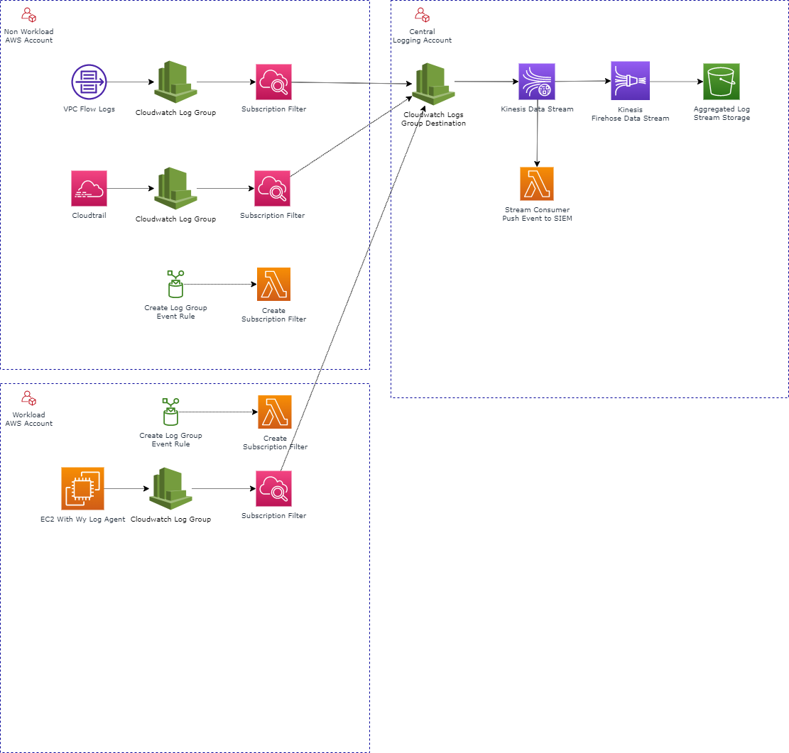

# Library of Cloud Patterns for AWS

# Table of Contents

This is generic pattern for Centralised logging within a multi account AWS landing

## Features

1. Auto provisioning of event data to destinations
1. Enables flexibilty to push to external SIEM services
1. Additional Kinesis stream for data aggregation  

# References

1. [AWS Blog: How to Facilitate Data Analysis and Fulfill Security Requirements by Using Centralized Flow Log Data](https://aws.amazon.com/blogs/security/how-to-facilitate-data-analysis-and-fulfill-security-requirements-by-using-centralized-flow-log-data/)
1. [AWS Blog: Stream Amazon CloudWatch Logs to a Centralized Account for Audit and Analysis](https://aws.amazon.com/blogs/architecture/stream-amazon-cloudwatch-logs-to-a-centralized-account-for-audit-and-analysis/)
