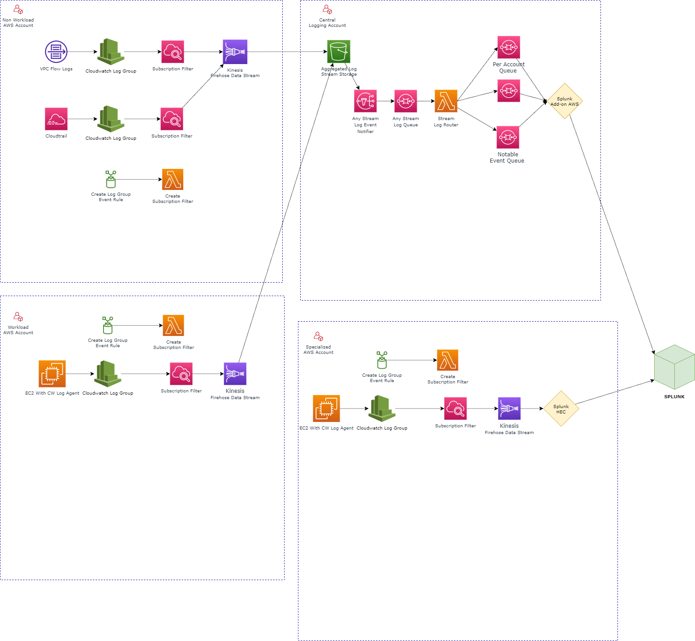

# Library of Cloud Patterns for AWS

# Table of Contents

This is generic pattern for Centralised logging using Splunk within a multi account AWS landing zone

## Features

1. Log Aggreation and Splitting available
1. Multiple Splunk Intergration Channels for specialised use cases  

# References

1. [AWS Blog: Making the Collection of Centralised S3 Logs into Splunk easy with Lambda and SQS](https://www.splunk.com/en_us/blog/tips-and-tricks/making-the-collection-of-centralised-s3-logs-into-splunk-easy-with-lambda-and-sqs.html)
1. [AWS Blog: Power data ingestion into Splunk using Amazon Kinesis Data Firehose](https://aws.amazon.com/blogs/big-data/power-data-ingestion-into-splunk-using-amazon-kinesis-data-firehose/)
1. [AWS Blog: https://docs.splunk.com/Documentation/AddOns/released/AWS/SQS](https://docs.splunk.com/Documentation/AddOns/released/AWS/SQS)
