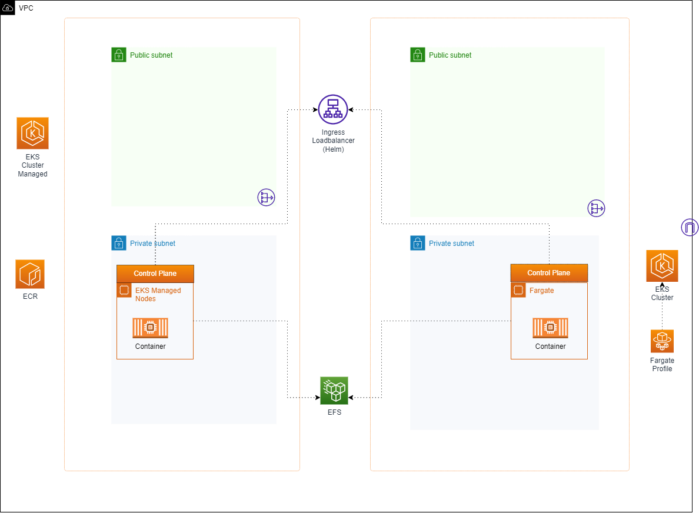
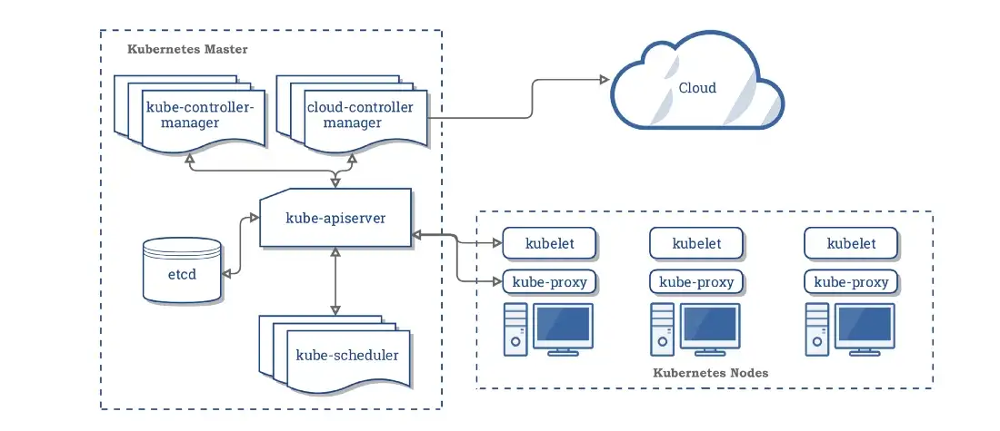
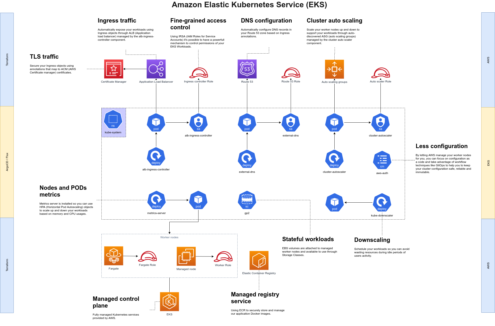

# Library of Cloud Patterns for AWS

🚧 Under Construction 🚧

# Table of Contents

This is a generic pattern for EKS, Fargate and EFS.

## Features

1. EKS Control plane
1. Ingress with AWS Loabalancer Helm 
1. EFS Share enabled

# References

1. [Anton Putra Blog: Create AWS EKS Fargate Using Terraform](https://antonputra.com/amazon/create-aws-eks-fargate-using-terraform/)
1. [AWS Blog: Kubernetes Security: AWS EKS with and without Fargate: Understanding the Differences](https://sysdig.com/learn-cloud-native/kubernetes-security/aws-eks-with-and-without-fargate-understanding-the-differences/)
1. [AWS Blog: Create an Amazon EKS Cluster with Managed Node Group using Terraform](https://blog.devgenius.io/create-an-amazon-eks-cluster-with-managed-node-group-using-terraform-a3b50d276b13)
1. [AWS Blog: Serverless Kubernetes, Managed Nodes on AWS EKS, and More](https://dzone.com/articles/serverless-kubernetes-managed-nodes-on-aws-eks-and)