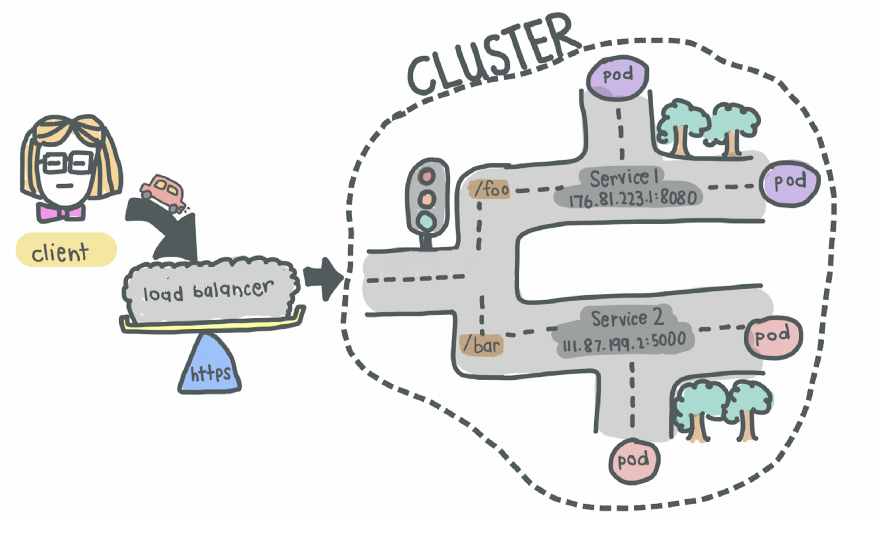

# Introduction
In this page we will go through an application deployment template to review the various working components of containerised application deployment

# Application Overview
For our discussion, we will review a containerised application which is the [Octopus Deploy](https://octopus.com/docs/installation/octopus-server-linux-container/octopus-in-kubernetes) continous delivery server.

The Octopus Deploy vendor has published offical docker images for their octopus deployment server application. 

Kubernetes manifests i.e. declarative deployment configuration will be provided as reference.

## Pre-requisites
1. The application container can run in a minikube cluster local
1. Since this is a dotnet application it will require an accompanying mssql database which will also be container based

## Deployment Overview



## Application Configuration

### Web Deployment Service 
```
apiVersion: v1
kind: Service
metadata:
  name: octopusdeploy
spec:
  selector:
    app: octopusdeploy
  ports:
    - port: 8080
  type: LoadBalancer
```

### Web Deployment
```
---
apiVersion: apps/v1
kind: Deployment
metadata:
  name: octopusdeploy
spec:
  selector:
    matchLabels:
      app: octopusdeploy
  replicas: 1 #Limiting replicas to 1 since this is a local deployment
  template:
    metadata:
      labels:
        app: octopusdeploy
    spec:
      containers:
      - name: octopusdeploy
        image: octopusdeploy/octopusdeploy:latest
        imagePullPolicy: IfNotPresent
        resources:
          limits:
            memory: 2Gi
            cpu: 200m
        env:
        - name: ACCEPT_EULA
          value: "Y"
        - name: ADMIN_USERNAME
          value: "admin"
        - name: ADMIN_PASSWORD
          value: "<A Secure Password>"
        - name: DB_CONNECTION_STRING
          value: "Server=db,1433;Database=OctopusDeployDB;User=sa;Password=<A Secure Password>"
        - name: MASTER_KEY
          value: "<Base 64 encoded master key>"
        ports:
        - containerPort: 8080
        - containerPort: 10943
        volumeMounts:
          - name: tasklogs
            mountPath: /taskLogs
          - name: artifacts
            mountPath: /artifacts
          - name: repository
            mountPath: /repository
      volumes:
        - name: tasklogs
          hostPath:
            path: /data
            type: Directory
        - name: artifacts
          hostPath:
            path: /data
            type: Directory
        - name: repository
          hostPath:
            path: /data
            type: Directory
```

### DB Deployment Service

```
---
apiVersion: v1
kind: Service
metadata:
  name: mssql
spec:
  type: ClusterIP
  ports:
    -
      port: 1433
      targetPort: 1433
      protocol: TCP
  selector:
    app: mssql
```

### DB Deployment
```
---
apiVersion: apps/v1
kind: Deployment
metadata:
  name: mssql
  labels:
    app: mssql
spec:
  selector:
    matchLabels:
      app: mssql
  replicas: 1
  strategy:
    type: Recreate
  template:
    metadata:
      labels:
        app: mssql
    spec:
      terminationGracePeriodSeconds: 10
      securityContext:
        fsGroup: 10001
      volumes:
        - name: mssqldb
          persistentVolumeClaim:
            claimName: mssql-data
      containers:
        - name: mssql
          image: mcr.microsoft.com/mssql/server:2019-latest
          resources:
            limits:
              memory: 2Gi
              cpu: 500m
          ports:
            - containerPort: 1433
          env:
            - name: MSSQL_PID
              value: Express
            - name: ACCEPT_EULA
              value: 'Y'
            - name: SA_PASSWORD
              value: <A Secure Password>
            - name: MSSQL_SA_PASSWORD
              value: <A Secure Password>
          volumeMounts:
            - name: mssqldb
              mountPath: /var/opt/mssql

```


