[[_TOC_]]

# Introduction
This page will provide a quick introduction into openshift.

# Openshift Architecture Overview

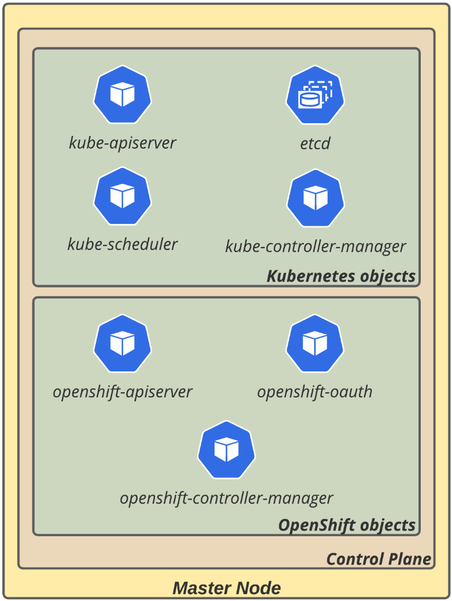

## Openshift operators and namespaces

### Openshift operators
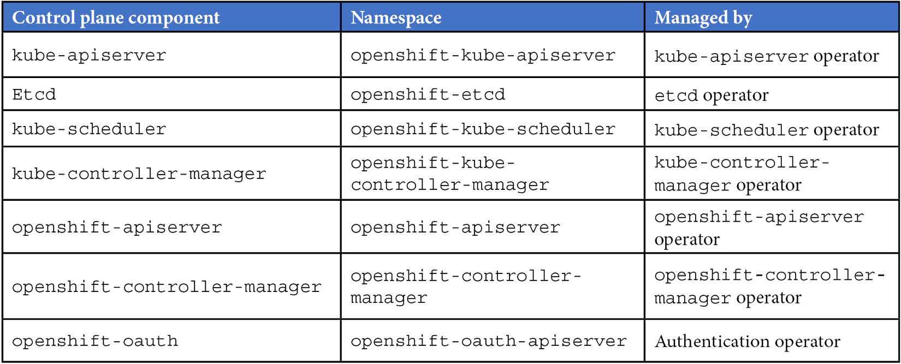

Operators are a standard way to package, deploy, and maintain Kubernetes applications and objects. They use Custom Resource Definitions (CRDs) to extend the Kubernetes API functionality to enable bespoke capabilities to manage the cluster and the container application lifecycle.

# Worker Nodes

## Red Hat Enterprise Linux CoreOS (RHCOS)

Redhat recommends using RHCOS over RHEL in OCP

- It is an immutable OS which uses rpm-ostree to enable atomic transactional upgrades and adds consistency to the infrastructure
- RHCOS's default container runtime is CRI-O. It also comes with a set of tools to work with containers, such as podman and skopeo.
- RHCOS is based on RHEL
- Managed by Machine Config Operator (MCO): To allow a high level of automation and also keep secure upgrades, OpenShift uses the MCO to manage the configurations of the operating system. It uses the rpm-ostree system to make atomic upgrades, which allows safer and easier upgrade and rollback (if needed).

## Worker Node Types

- Application workers: Responsible for hosting the workloads
- Infrastructure workers: This type of server is usually used to host the platform infrastructure tools, such as the ingress (routers), internal registry, the monitoring stack (Prometheus and Grafana), and also the logging tool (Elasticsearch and Kibana).
- Storage workers: Container storage solutions, such as Red Hat OpenShift Data Foundation, usually require some dedicated worker nodes to host their Pods. In such cases, a best practice is to use a dedicated node group for them.

## OCP HA Architecuture

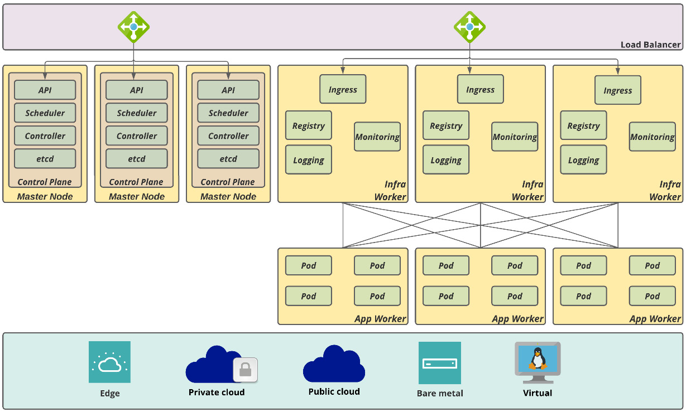

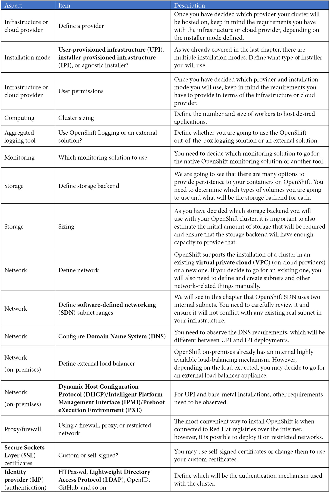

## OCP Installtion

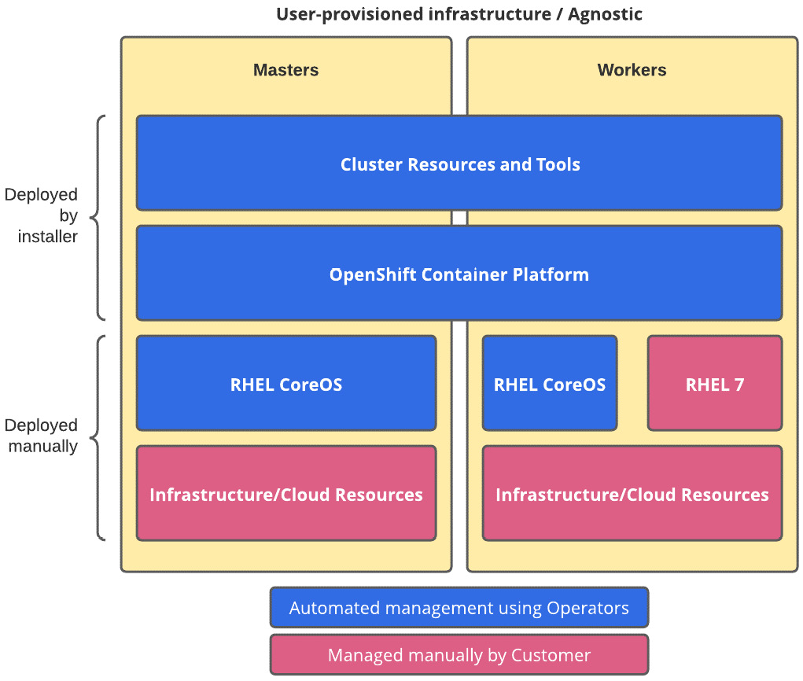

## Cluster Sizing and Isolations

### Master Node Sizing
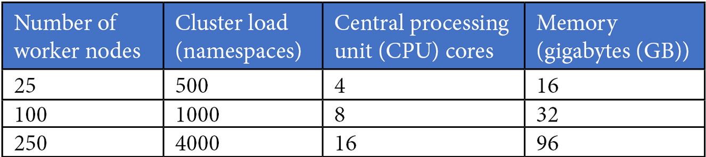

### Infrastructure Node Sizing

> However, the preceding table does not consider OpenShift logging. Therefore, if you are planning to use it, add at least four more virtual CPUs (vCPUs) and 16 GB to the nodes on which Elasticsearch instances will be host

### Resource Allocation Formula

$$ Allocatable Resources =  [Node Capacity] - [Kube-reserved] - [System-reserved] - [hard-eviction-threshold] $$

The default values for OpenShift workers are as follows (at the time of this writing):

CPU:
- system-reserved = 500m
- kube-reserved = 0m
- hard-eviction = 0m

Memory:
- system-reserved = 1Gi
- kube-reserved = 0Gi
- hard-eviction = 100Mi

> "m" stands for millicore, a standard Kubernetes unit that represents one vCPU divided into 1,000 parts.

$$ Recommended Allocatable Resources =  [Allocatable Resources] * 0.75 $$

> RAR implies that 25% percent spare capacity is made available. 

#### Example

Servers with 8 vCPUs and 32 GB random-access memory (RAM) as the default size.

CPU | Memory 
---------|----------
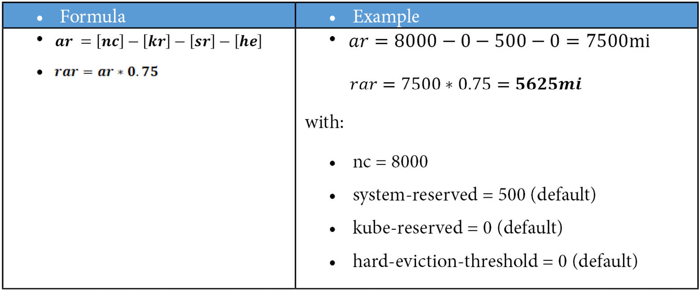 | 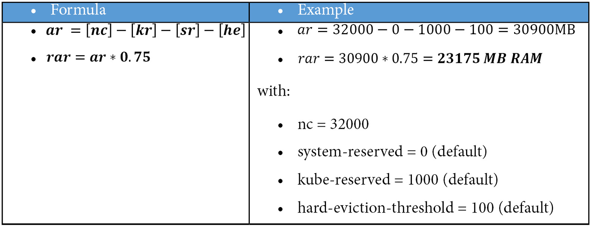

> Therefore, a worker with 8 vCPUs and 32 GB RAM will have approximately 5 vCPUs and 23 GB RAM considered as the usable capacity for applications. Considering an example in which an application Pod requires on average 200 millicores and 1 GB RAM, a worker of this size would be able to host approximately 23 Pods (limited by memory). 

## Openshift Logging

OpenShift Logging tool that is based on Elasticsearch, Kibana, and Fluentd.

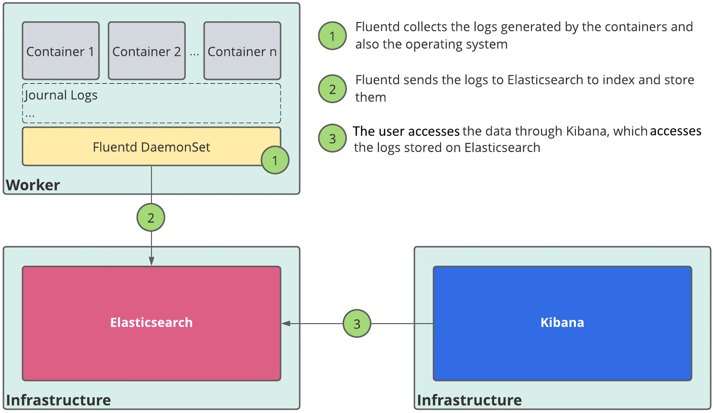

It is an optional component. Setup ClusterLogForwarder to forwar logs to existing solution

## Openshift Monitoring

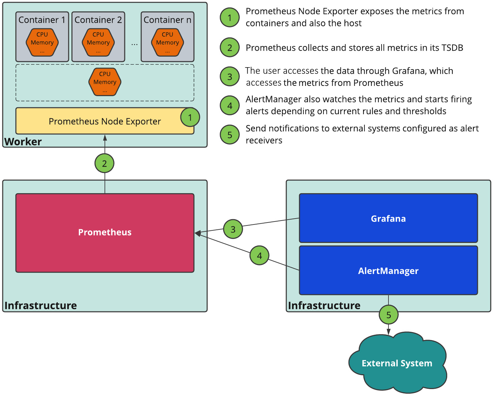

OpenShift monitoring is not optional; it is used by many internal platform components. However, if you do not intend to use it in favor of another monitoring tool, you may keep it using ephemeral storage. On the other hand, if you are planning to use it, we recommend you provide persistent storage to save the monitoring metrics.

## Openshift Storage

### Storage backends

There are two types of storage implementations: in-tree and CSI plugins.

#### Intree

In-tree plugins are implementations that allow a Kubernetes platform to access and use external storage backends. The name in-tree comes from the fact that these implementations are developed and released in the main Kubernetes repositories, as in-tree modules. There are several types of supported in-tree plugins with OpenShift, as follows (*):

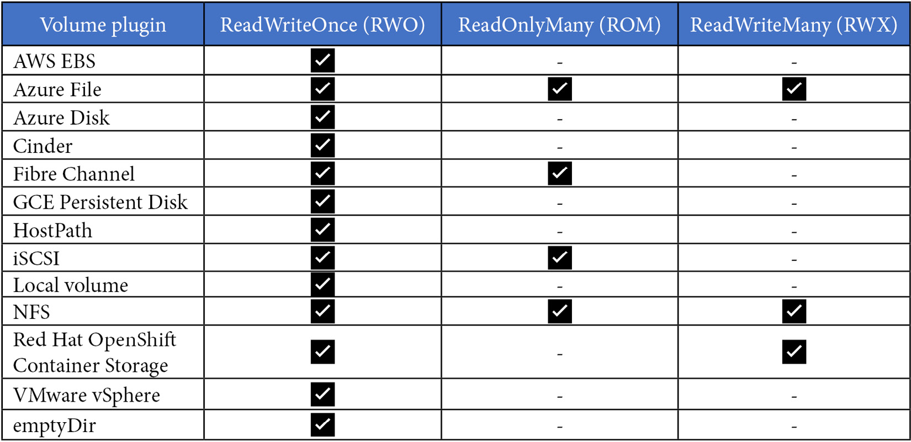

#### CSI drivers

With more and more storage providers supporting Kubernetes, the development and maintenance of in-tree plugins became difficult and was no longer the most efficient model. The CSI has been created in this context: to provide a standard way to extend Kubernetes storage capabilities using API interfaces. With CSI, it is possible to also have interesting features such as snapshots, resizing, and volume cloning; however, it is up to the storage provider to implement these features or not, so check with them if they have a CSI driver implementation available and which operations are implemented and supported.

> Red Hat supports the CSI APIs and implementation from the OpenShift side; however, support of the storage side is a storage vendor's responsibility. Check with your storage vendor if there is a supported CSI option for OpenShift.

### Storage

120 Gb with 500 IOPS

### Storage for Application Logging

> Example Volume size required for an application that generates 10 lines of logs per second (lines-per-second); the lines have 256 bytes (bytes-per-line) on average, considering a retention period of 7 days for the logs:

This means that one single Pod of that application will consume nearly 1.5 GB over 7 days (the period for which a log will be stored on Elasticsearch). Another important thing to consider is Elasticsearch's replication factor, which will require more storage depending on the replication factor selected. There following replication factors are available:

* FullRedundancy: Replicates the primary shards for each index to every Elasticsearch node
* MultipleRedundancy: Replicates the primary shards for each index to 50% of the Elasticsearch nodes
* SingleRedundancy: Makes one copy of the primary shards for each index
* ZeroRedundancy: Does not make a copy of the primary shards

Volume type used by OpenShift Logging: RWO

### Storage for Monitoring

OpenShift monitoring is installed by default with the platform using ephemeral storage (also known as emptyDir), meaning that if the Prometheus pod gets restarted, all metrics data will be lost. To avoid losing metrics data, consider a persistent volume for Prometheus and AlertManager Pods. 

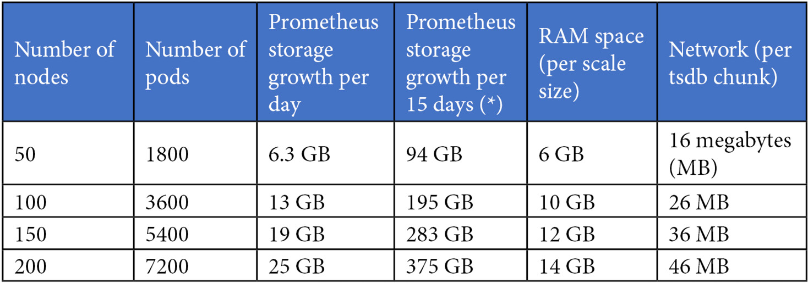

> 15 days is the default retention period.

You also need to consider volumes for AlertManager: typically, a volume size of 20 GB is enough for most cases.

By default, an HA configuration is composed of two Prometheus replicas and three AlertManager replicas.

For example, let's say that we are planning a cluster that will have no more than 50 nodes and 1,800 Pods. In that case, we'd need to use the following formula:

$$ Prometheus Space = 2 Pods * 94 GB  = 188 GB $$ 
$$ Alertmanager Space = 3 Pods * 20 GB  = 60 GB $$ 
$$ Total Space = 248 GB $$

Volume type used by OpenShift Monitoring: RWO

### Workload Sizing Use Case

Up to 20 Pods on the frontend consume 300 millicores and 1 GB RAM each at peak load. Each pod generates 30 lines of logs per second (256 bytes per line). Stateless Pods.
Up to 4 Pods on the backend need 500 millicores and 1 GB RAM each at peak load. Each pod generates 10 lines of logs per second (256 bytes per line). Stateless Pods.
1 MongoDB database instance with 8 GB RAM and 2 vCPUs. It generates 1 line of logs per second (256 bytes per line). An RWO volume is required of 500 GB.
Our logging stack is configured with ZeroRedundancy (there is no data replication).

#### Compute Sizing

$$ FE Pods = 20 * 300 = 6000m = 6vCPU $$
$$ BE Pods = 4 * 500 = 2000m = 2vCPU $$
$$ MongoDB = 2 vCPU $$

$$ Total CPU = 10vCPU = 10000m $$

#### Memory Sizing
$$ FE = 20GB; BE = 4GB; MongoDB = 8GB $$

$$ Total MEM = 32GB = 32000MB $$

#### Volume Sizing
MongoDB =  500GB RWO $$

#### Resource Allocation
Assume Nodes with 4vCPU and 16GB RAM 

$$ Allocatable Resources =  [Node Capacity] - [Kube-reserved] - [System-reserved] - [hard-eviction-threshold] $$
$$ CPU AR = 4000 - 0 - 500 = 3500m $$
$$ CPU RAR = CPU AR $$

CPU over commit should be generally accepatable 

$$ Allocatable Resources =  [Node Capacity] - [Kube-reserved] - [System-reserved] - [hard-eviction-threshold] $$
$$ Mem AR = 16000 - 0 - 1000 = 14900MB $$

$$ Mem RAR = AR * 0.75 $$

$$ Mem RAR = 14900 * 0.75 = 11175 MB RAM $$

#### Node Count

$$ CPU = 10000 / 3500 = 3 $$ 

$$ MEM = 32000 / 11175 = 3 $$ 

That means we will need 3 nodes with 4 vCPU and 16 GB RAM for running our workload

#### Storage Sizing

Virtual machines (VMs): 3 (nodes) * 120 GB (recommended per server) = 360 GB disk
Workload: 500 GB RWO
Internal registry: 200 GB RWX
Logging: 106 GB RWO (see diagram below)

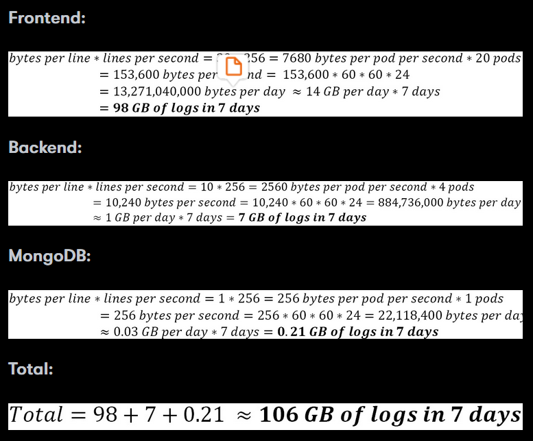

Monitoring: 248 GB RWO (as we saw in the previous section about the sizing for monitoring in a cluster up to 50 nodes and 1,800 Pods)

##### Node Requirements

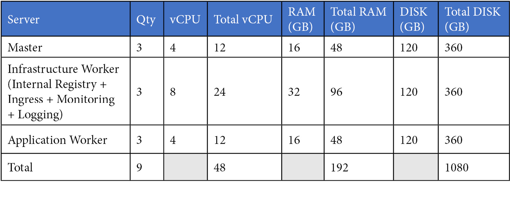

> 3 additional nodes dedicated to hosting the OpenShift infrastructure components (Logging, Monitoring, Registry, and Ingress)

##### Requirements for Persistent Volumes

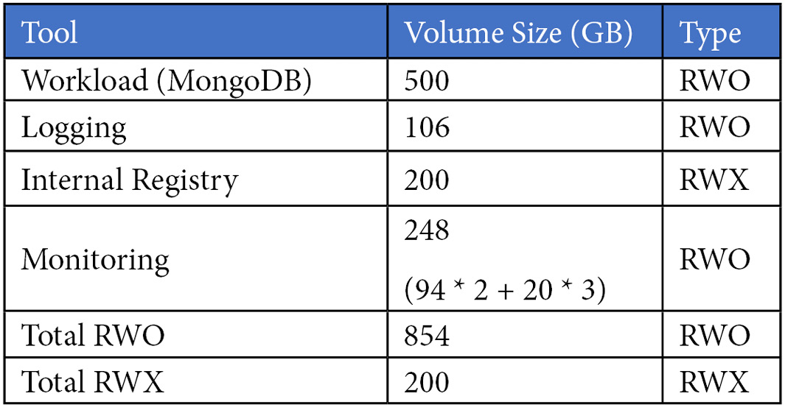

# References
https://www.packtpub.com/product/openshift-multi-cluster-management-handbook/9781803235288
https://kubernetes.io/docs/concepts/extend-kubernetes/operator/
https://docs.openshift.com/container-platform/latest/scalability_and_performance/scaling-cluster-monitoring-operator.html

