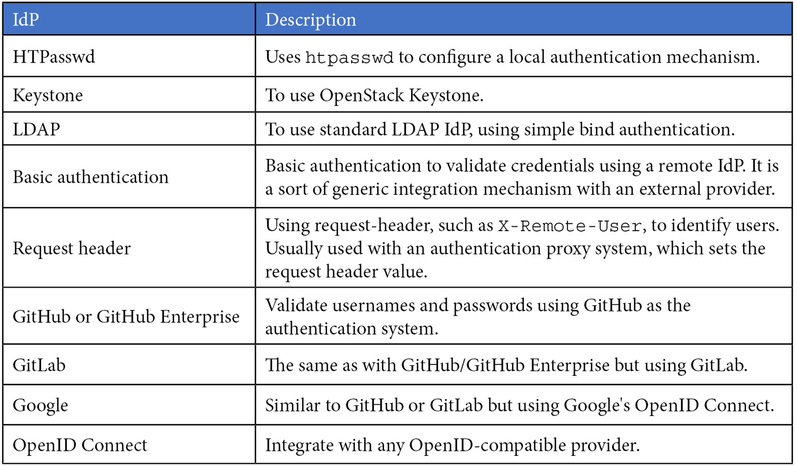
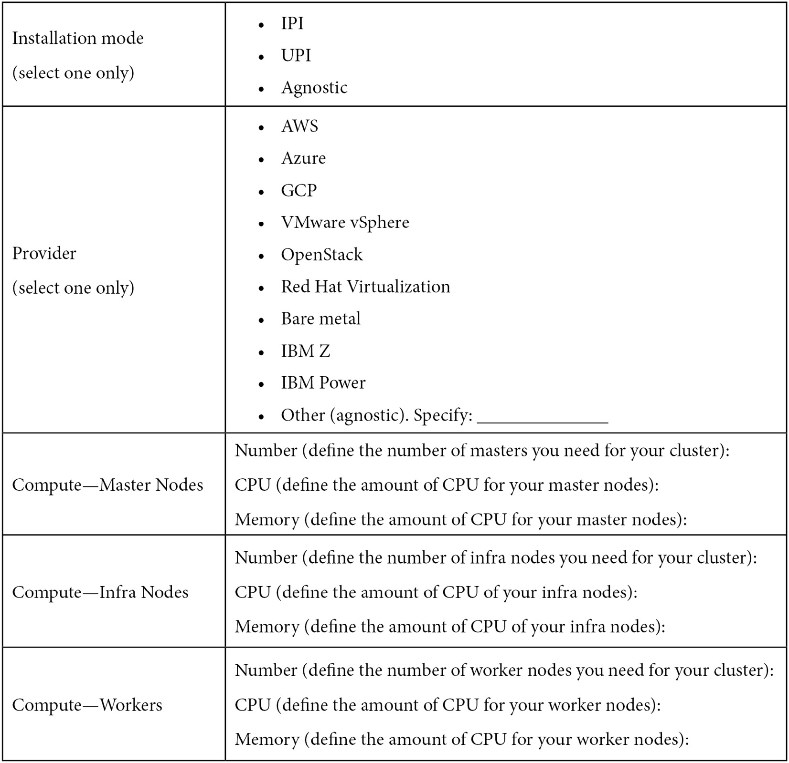
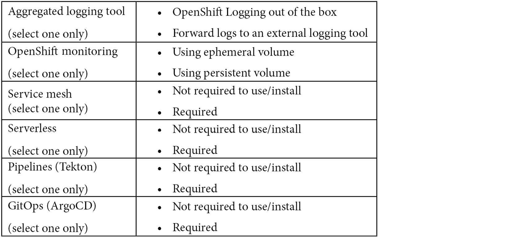
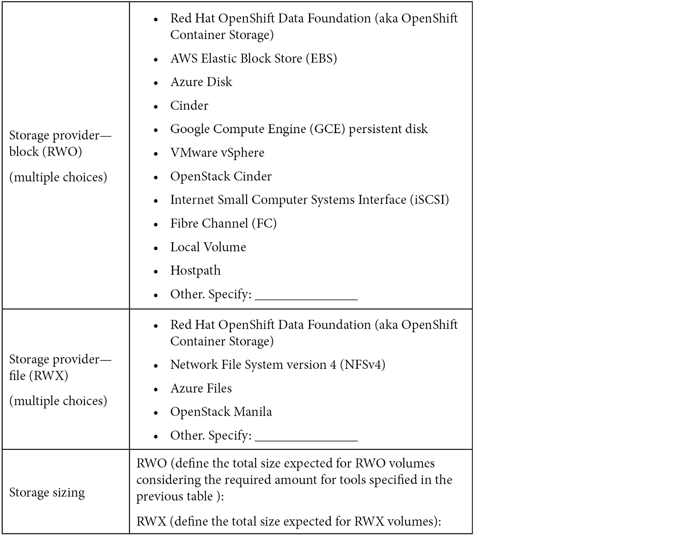
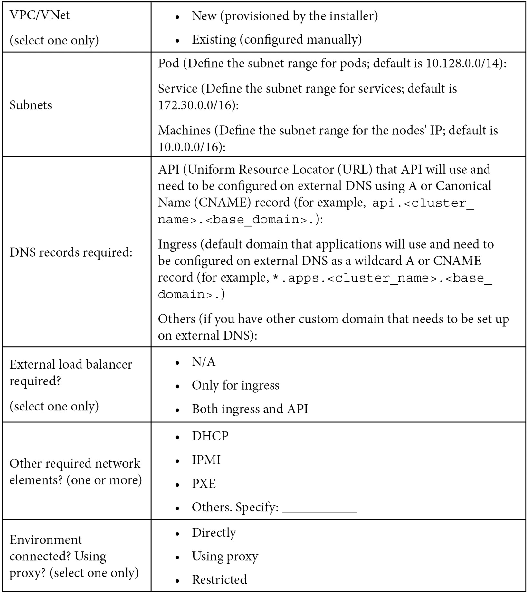
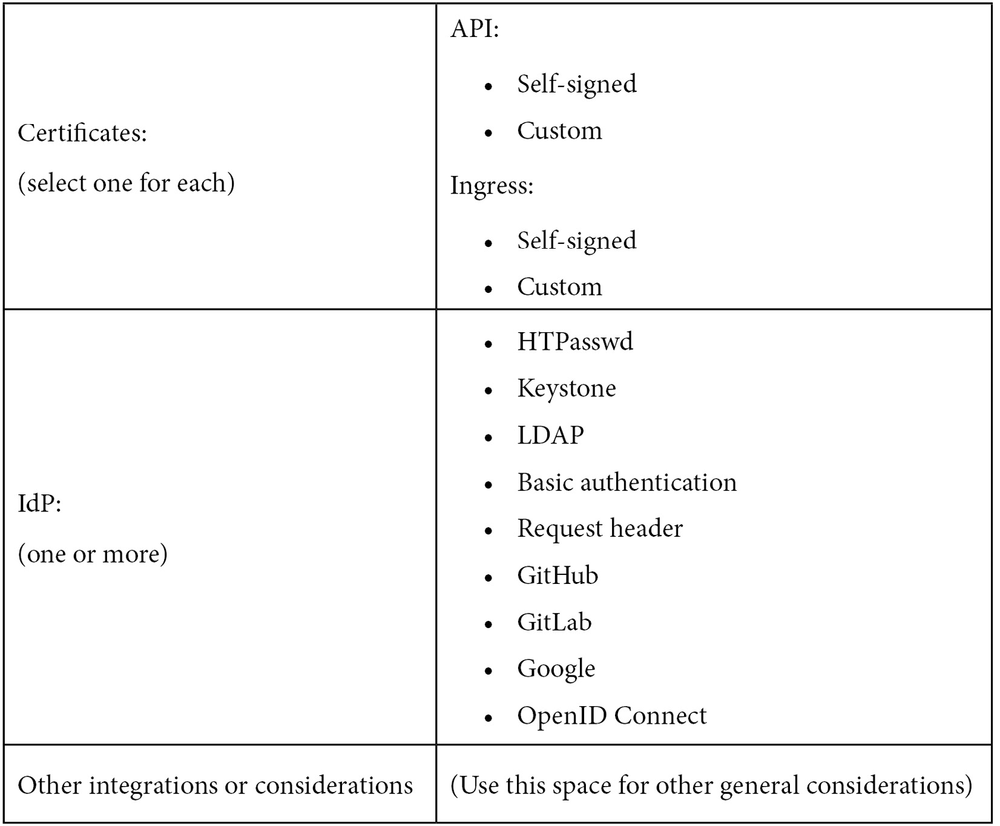

[[_TOC_]]

# Introduction

In the previous page, we had a look at the OCP platform overview. Now lets continue..

# Network Considerations

OCP uses OpenVSwitch(OvS) network SDN plugin. and supports OVN-K8s plugins as well.

```
Pod Network = 10.128.0.0/14
SVC Network = 172.30.0.0/16
```

> Network ranges cannot be changed after cluster installation

## Network Constraints

1. No overlapping IP ranges with external networks as OCP will always route that traffic internally.
1. Think of VPC or VNET; 
1. DNS; 
1. SLB; 
1. DHCP/ IPMI /PXE : Optional
1. Ingress and Egress
1. TLS : self signed certs needs to be replaced
1. IDPs : 


# Architectural Checklist







# References
Network plugins: https://docs.openshift.com/container-platform/4.13/networking/openshift_sdn/about-openshift-sdn.html#nw-ovn-kubernetes-matrix_about-openshift-sdn

etcd documentation: https://etcd.io/docs/latest/
Kubernetes official documentation: https://kubernetes.io/docs/home/
About Kubernetes Operators: https://kubernetes.io/docs/concepts/extend-kubernetes/operator/
Documentation about rpm-ostree: https://coreos.github.io/rpm-ostree/
CSI drivers supported by Open Container Platform (OCP): https://docs.openshift.com/container-platform/4.8/storage/container_storage_interface/persistent-storage-csi.html#csi-drivers-supported_persistent-storage-csi
Graphical explanation about allocatable resources: https://learnk8s.io/allocatable-resources
How to plan your environment according to application requirements: https://docs.openshift.com/container-platform/latest/scalability_and_performance/planning-your-environment-according-to-object-maximums.html#how-to-plan-according-to-application-requirements_object-limits
Recommended host practices, sizing, and others: https://docs.openshift.com/container-platform/latest/scalability_and_performance/recommended-host-practices.html
