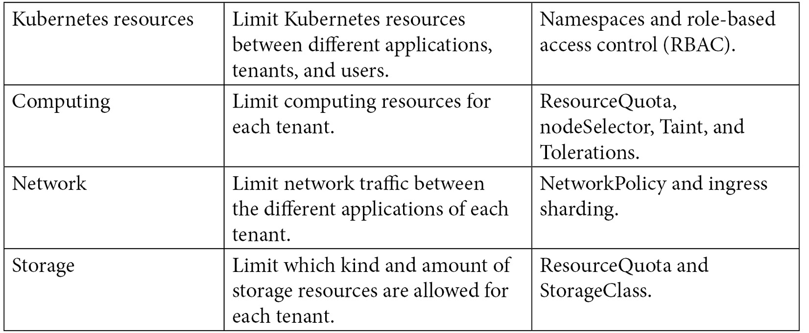
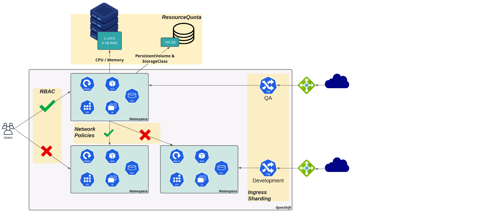
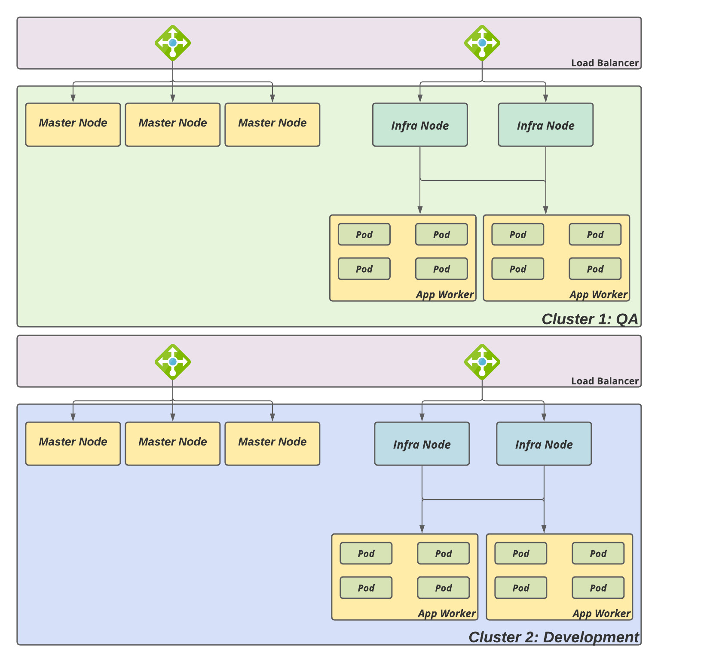
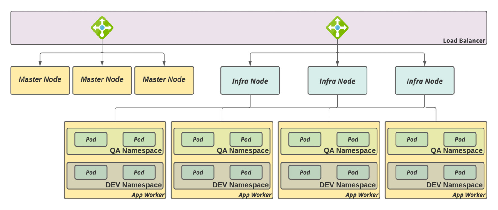
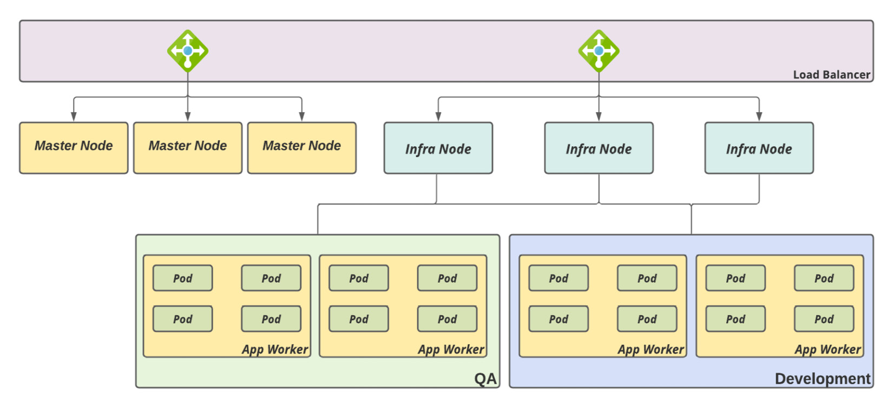
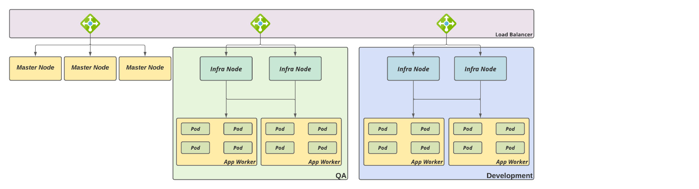
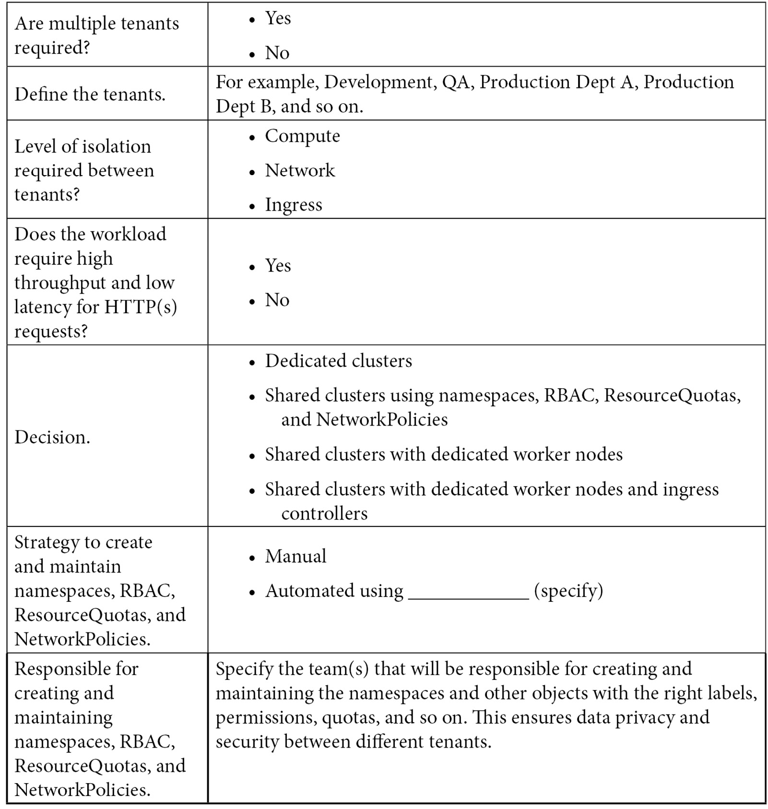

[[_TOC_]]

# Introduction

For multitenancy; OCP can provide isolation for objects, computing, network, and other hardware resources for each tenant, ensuring they are isolated from each other.

# Isolating Paramaters

## RBAC

Roles: Roles are a set of actions (such as get, list, watch, create, upgrade, and so on) that are permitted over resources (such as Pods, Services, Deployments, Jobs, and so on)

RoleBindings: RoleBindings (or ClusterRoleBinding) are how you bind a role to a subject (groups, users, or ServiceAccounts)

## Resource Quotas

ResourceQuotas allows a cluster administrator to constraint a namespace to a limited set of resources.

## Node Selectors

Through nodeSelectors, you can dedicate workers for a specific reason or tenant. With nodeSelectors, you can isolate physical compute resources for each tenant;
For a 10-node cluster, you can have, five nodes for Prod and the other five for QA/Dev. 

Taints and tolerations are different ways of doing this: while with nodeSelectors, you instruct a Pod to be scheduled in a defined set of nodes that contain a certain label, with taints, you instruct a worker to repeal Pods that do not contain a certain toleration to run in it.

## Network Policy

A NetworkPolicy provides a standard way to isolate network traffic between Pods and namespaces. It works like a firewall in which you define ingress and/or egress policies to accept/deny traffic flows between different Pods and namespaces.

## Ingress/router sharding

On OCP, you can create multiple ingress controllers, which will allow you to isolate ingress traffic between different tenants.

# Multi-tenant strategies

It is important to understand that there is no physical isolation when using the multi-tenant objects listed previously – isolation is defined and implemented by the software.

## Dedicated clusters, one for each tenant

Pros | Cons 
---------|----------
Highest Isolation | High cost (at least 5 Nodes per cluster isolation : 3 Master and 2 Infra )
Compute Resource Guaranteed | Operational Overhead 
 
## A shared cluster with no physical separation of resources

Pros | Cons 
---------|----------
Namespaces, RBAC, ResourceQuotas, and NetworkPolicies etc for isolation | 
Good for NonProd | 

## A shared cluster with dedicated worker nodes

Pros | Cons
---------|----------
Isolation per workload | Less efficient resource usage 
Operational Effort | No ingress isolation
Good for NonProd | 

## A shared cluster with dedicated worker nodes and ingress controllers

Pros | Cons
---------|----------
Isolation per workload | Less efficient resource usage 
Operational Effort | 
Good for NonProd and Prod |

## Additional checklist

# References

Capacity baseline for a single OpenShift ingress (HAProxy): https://docs.openshift.com/container-platform/latest/scalability_and_performance/routing-optimization.html

What is multitenancy? https://www.redhat.com/en/topics/cloud-computing/what-is-multitenancy

Multi-tenant network isolation (OpenShift documentation): https://docs.openshift.com/container-platform/4.8/networking/network_policy/multitenant-network-policy.html
