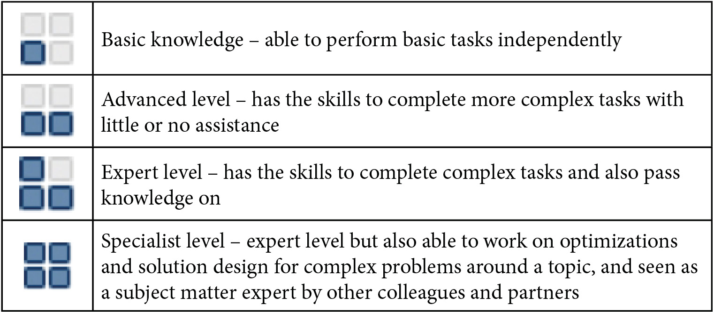
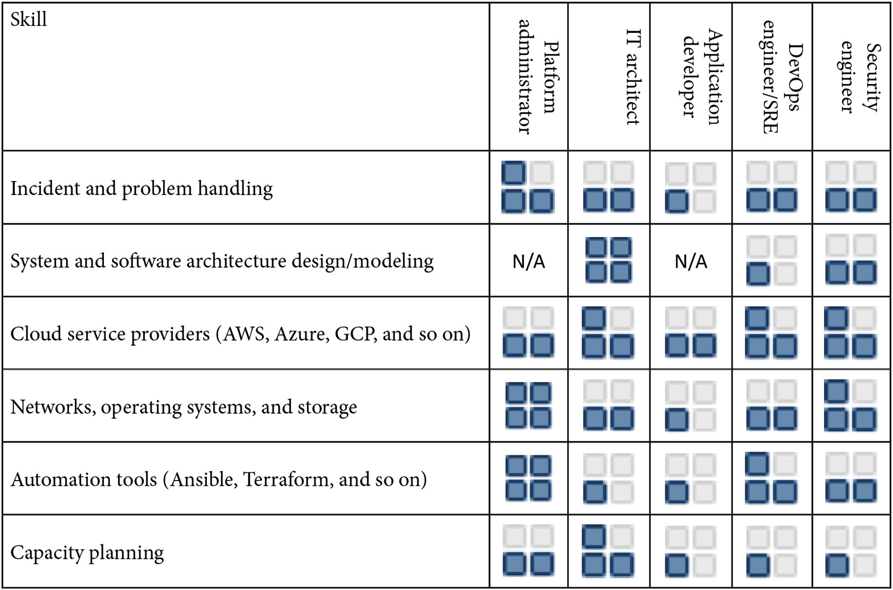
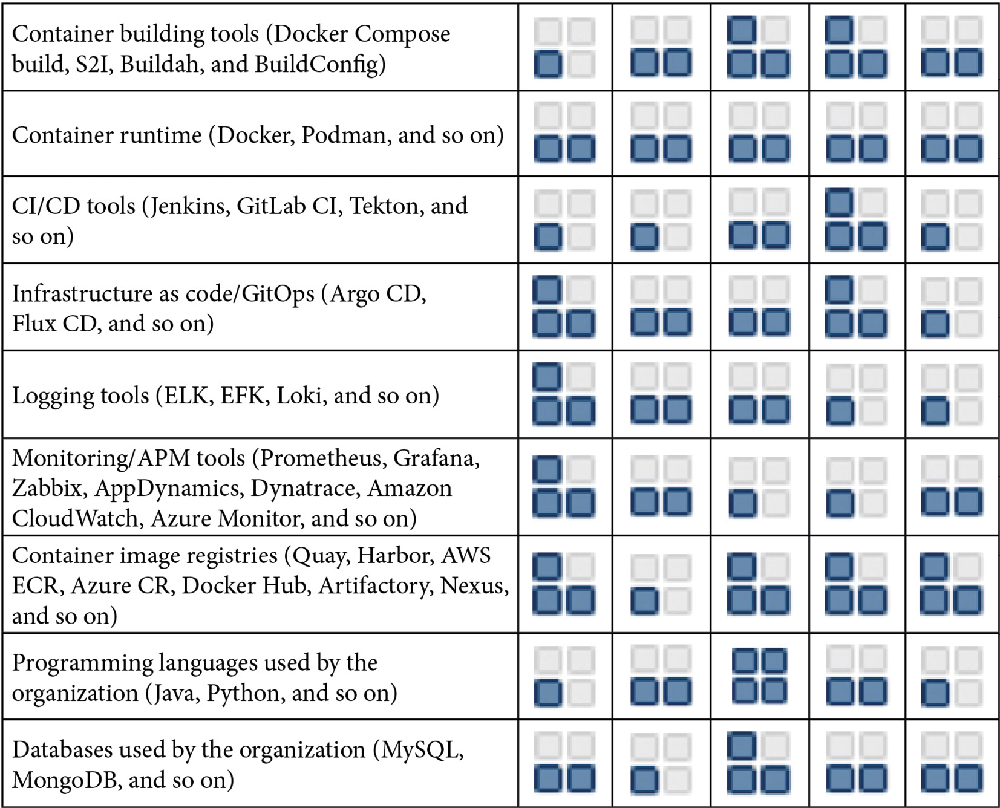

[[_TOC_]]

# Personnel Operating Model

# Skill Matrix

## Infra Skills

## Dev Skills

## Openshift Skills

# References

What is a skills matrix and should I use one in 2021?: https://www.skills-base.com/what-is-a-skills-matrix-and-should-i-use-one-in-2021

Everything-as-Code: https://openpracticelibrary.com/practice/everything-as-code/

GitOps: https://openpracticelibrary.com/practice/gitops/

How Full is My Cluster? Capacity Management and Monitoring on OpenShift: https://cloud.redhat.com/blog/full-cluster-capacity-management-monitoring-openshift

A layered approach to container and Kubernetes security: https://www.redhat.com/en/resources/layered-approach-container-kubernetes-security-whitepaper

OpenShift Container Platform architecture: https://docs.openshift.com/container-platform/4.9/architecture/architecture.html
