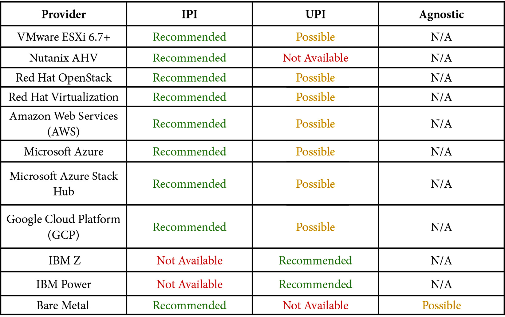
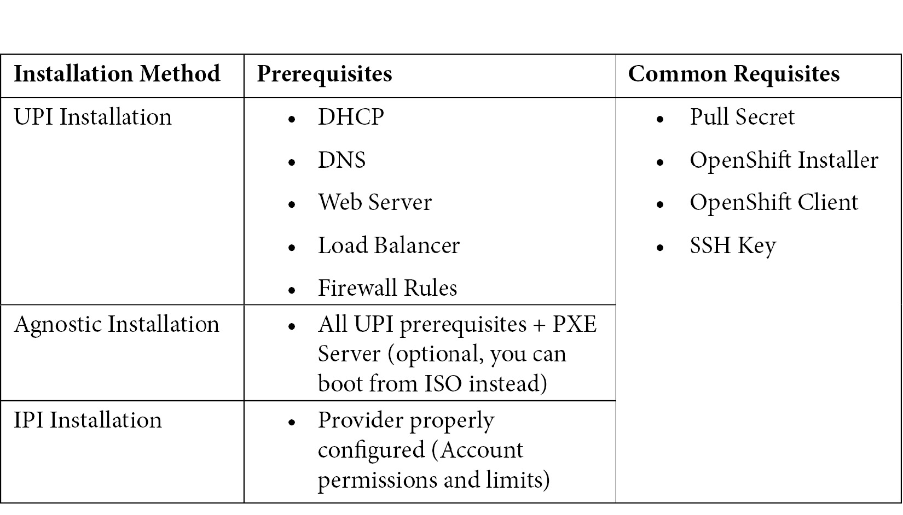

[[_TOC_]]

# Introduction

Two types of deployment:

Installer-Provisioned Infrastructure (IPI) deployment
User-Provisioned Infrastructure (UPI) deploymentent
Agnostic (Bare-metal) deployment




# Pre-requisites

## DNS

```
# ocp.myhybridcloud.com
sudo yum install bind bind-utils -y
sudo systemctl enable --now named
sudo firewall-cmd --permanent --add-port=53/tcp
sudo firewall-cmd --permanent --add-port=53/udp
sudo firewall-cmd --reload
```

```
# Create the sub domain
sudo cat << EOF >>  /etc/named.conf
zone "ocp.myhybridcloud.com" IN {
type master;
file "/var/named/ocp.myhybridcloud.com.db";
allow-query { any; };
allow-transfer { none; };
allow-update { none; };
};
zone "1.168.192.in-addr.arpa" IN {  
type master;  
file "/var/named/1.168.192.in-addr.arpa";
allow-update { none; };
};
EOF

```

```
# Create a forwarding zone
sudo cat <<EOF > /var/named/ocp.myhybridcloud.com.db
;[1] Begin Common Header Definition
\$TTL 86400
@ IN SOA bastion.ocp.myhybridcloud.com. root.ocp.myhybridcloud.com. (
202201010001 ;Serial
21600 ;Refresh
3600 ;Retry
604800 ;Expire
86400 ;Minimum TTL
)
;End Common Header Definition
;Name Server Information [2]
   IN NS bastion.ocp.myhybridcloud.com.
;IP address of Name Server [3]
bastion IN A 192.168.1.200
;api internal and external purposes [4]
api        IN    A    192.168.1.200 
api-int    IN    A    192.168.1.200 
;wildcard application [5]
*.apps     IN    A    192.168.1.200
;bootstrap node to start cluster install only [6]
bootstrap  IN    A    192.168.1.90 
;master nodes [7]
master1    IN    A    192.168.1.91 
master2    IN    A    192.168.1.92 
master3    IN    A    192.168.1.93
;worker nodes [8]
worker1    IN    A    192.168.1.101
worker2    IN    A    192.168.1.102
EOF

[1]: Common DNS zone header.
[2]: The nameserver will be its own Bastion server.
[3]: The IP address from the nameserver (Bastion IP).
[4]: These records are mandatory and need to point to the VIP that will be used for the OpenShift API functions. In our case, we are using the bastion server as the VIP (suitable only for lab environments).
[5]: Wildcard VIP record used for the applications that run on OpenShift. In our case, we are using the bastion server as the VIP (suitable only for lab environments).
[6]: Bootstrap node IP record, used only for the cluster installation and can be removed after it.
[7]: Master node IP records, where the control plane objects will be hosted.
[8]: Worker node IP records, where the workloads will run. If you go for a three-node cluster, disregard the worker hosts.
```

```
# Create a reverse zone file
sudo cat <<EOF > /var/named/1.168.192.in-addr.arpa
\$TTL 1W @    IN    SOA    bastion.ocp.myhybridcloud.com.root (     
2019070700 ; serial 
3H         ; refresh (3 hours) 
30M        ; retry (30 minutes) 
2W         ; expiry (2 weeks) 
1W )       ; minimum (1 week) 
5.1.168.192.in-addr.arpa. IN PTR 
api.ocp.myhybridcloud.com.;
5.1.168.192.in-addr.arpa. IN PTR 
api-int.ocp.myhybridcloud.com.;
90.1.168.192.in-addr.arpa. IN PTR 
bootstrap.ocp.myhybridcloud.com.; 
91.1.168.192.in-addr.arpa. IN PTR 
master1.ocp.myhybridcloud.com.; 
92.1.168.192.in-addr.arpa. IN PTR 
master2.ocp.myhybridcloud.com.; 
93.1.168.192.in-addr.arpa. IN PTR 
master3.ocp.myhybridcloud.com.; 
101.1.168.192.in-addr.arpa. IN PTR 
worker1.ocp. myhybridcloud.com.; 
102.1.168.192.in-addr.arpa. IN PTR 
worker2.ocp. myhybridcloud.com.;
EOF
```
> Important Notes:
> Do not create a reverse zone record for the application's wildcard VIP, as that will lead to the wrong DNS resolution.
> If you created it for a three-node cluster, disregard the worker A and PTR records.

```
sudo systemctl restart named
# Validate the OpenShift API
dig +short @192.168.1.200 api.ocp.myhybridcloud.com
dig +short @192.168.1.200 api-int.ocp.myhybridcloud.com

# Validate the application's wildcard
dig +short @192.168.1.200 joedoe.apps.ocp.hybridmycloud.com
dig +short @192.168.1.200 whatever.apps.ocp.hybridmycloud.com

```

## DHCP

```

sudo yum install dhcp-server -y
```

```
cat <<EOF > /etc/dhcp/dhcpd.conf
# DHCP Server Configuration file.
#[1]
ddns-update-style interim;
ignore client-updates;
authoritative;
allow booting;
allow bootp;
allow unknown-clients;
default-lease-time 3600;
default-lease-time 900;
max-lease-time 7200;
#[2]
subnet 192.168.1.0 netmask 255.255.255.0 {
option routers 192.168.1.254;
option domain-name-servers 192.168.1.200;
option ntp-servers 192.168.1.200;
next-server 192.168.1.200; #[2.1]
#filename "pxelinux.0";#[2.2]
#[3]
group {
host bootstrap {
hardware ethernet 50:6b:8d:aa:aa:aa;
fixed-address 192.168.1.90;
option host-name "bootstrap.ocp.hybridmycloud.com";
allow booting;
}
host master1 {
hardware ethernet 50:6b:8d:bb:bb:bb;
fixed-address 192.168.1.91;
option host-name "master1.ocp.hybridmycloud.com";
allow booting;
}
host master2 {
hardware ethernet 50:6b:8d:cc:cc:cc;
fixed-address 192.168.1.92 ;
option host-name "master2.ocp.hybridmycloud.com";
allow booting;
}
host master3 {
hardware ethernet 50:6b:8d:dd:dd:dd;
fixed-address 192.168.1.93 ;
option host-name "master3.ocp.hybridmycloud.com";
allow booting;
}
host worker1 {
hardware ethernet 50:6b:8d:11:11:11;
fixed-address 192.168.1.101;
option host-name "worker1.ocp.hybridmycloud.com";
allow booting;
}
host worker2 {
hardware ethernet 50:6b:8d:22:22:22;
fixed-address 192.168.1.102;
option host-name "worker2.ocp.hybridmycloud.com";
allow booting;
}
}
} 
EOF
sudo systemctl enable --now dhcpd
sudo firewall-cmd --add-service=dhcp --permanent
sudo firewall-cmd --reload
```

```
[1]: Common settings to define DHCP as authoritative in that subnet and times of IP lease.
[2]: Scope subnet definition:
    [2.1] and [2.2]: Must be defined when using a PXE server, helpful for bare metal installations. In this lab, we are going to use VMs and, as such, that will not be used; therefore, leave it commented (using the # character at the beginning of the line).
[3]: A group with all nodes to lease IP addresses. If you go for a three-node cluster, disregard the worker hosts.
```

> Important Note
> After you create the VMs in your hypervisor, update dhcpd.conf accordingly with the MAC addresses you get from the network interfaces; otherwise, no IP address will be given to this subnet.

## Web Server
A web server is used to serve the OS image to install nodes, and also to provide the Ignition files (Ignition files are manifest files encoded on base64).

```
sudo yum install httpd policycoreutils-python-utils –y
sudo sed –i 's/80/81/g' /etc/httpd/conf/httpd.conf
sudo semanage port -a -t http_port_t -p tcp 81
sudo firewall-cmd --add-port 81/tcp --permanent
sudo firewall-cmd --reload

sudo mkdir –p /var/www/html/images
sudo mkdir –p /var/www/html/ignition
sudo touch /var/www/html/images/imageFileToTest.txt
sudo touch /var/www/html/ignition/ignitionFileToTest.txt
sudo mkdir –p /var/www/html/images
sudo mkdir –p /var/www/html/ignition
sudo touch /var/www/html/images/imageFileToTest.txt
sudo touch /var/www/html/ignition/ignitionFileToTest.txt
sudo systemctl enable --now httpd 

curl –O http://192.168.1.200:81/images/imageFileToTest.txt
curl –O http://192.168.1.200:81/ignition/ignitionFileToTest.txt

```

# Load balancer

# References

https://github.com/PacktPublishing/OpenShift-Multi-Cluster-Management-Handbook/tree/main/chapter05

