# Key Notes for MC Landing Zone 

# Provision

# Provision AWS Isolation
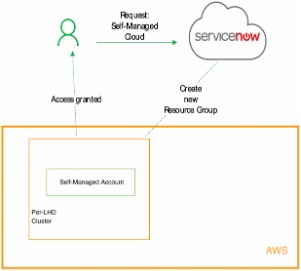

# Provision Azure Isolation
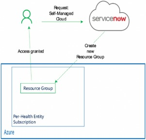

# RASCI

1. Cloud Broker (Platform Management Entity)
2. Cloud Consumer (Self-Managed Cloud Requestor)
3. Cloud Provider (AWS & Azure)
4. SMC owner
* The SMC Owner maintains full control of the SMC and will be able to login administratively to the native Cloud Portals 
* Any incidents or Risks associated with will assigned to the Self-Managed Cloud owner 
* Broadcasts and notification will be send to the Self-Managed Cloud Owner 
* The Self-Managed Cloud owner can transfer ownership and request decommission of a self-managed cloud
5. Technical Delegate (SMC)
6. IT Authority - CIO / Delegate 
7. Cloud Advisory
8. Platform Team
* Core Networking Between HWAN and Public Cloud 
* Express Routes / Direct Connects 
* Platform Provisioning Layer (Service Catalogue Items) 
* Enterprise Agreements 
* Continuous Platform Developments / Releases Provider: 
* Infrastructure Proxy 
* Hybrid DNS Integration 
* State Wide Cloud IP Allocation Schema 
* Platform Security Compliance 
* SOC Integration 
* CIS OS Community Harden Image

# Cloud Identities and Access Model
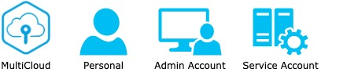
- MC Account
- Admin Account
- Personal Account
- Service or Automation Accounts : Service Principal or IAM User with programmatic access

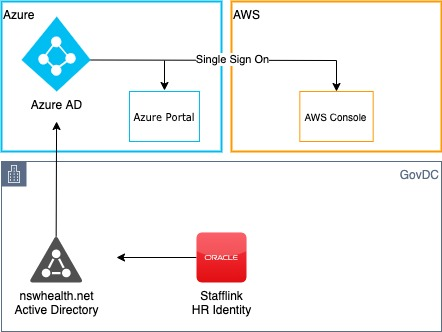
Azure Portal 
AWS Console : 
* Legacy : myapps.microsoft.com 
    - federated access with AAD
* New:  myapps.microsoft.com
    - Cloud Service SSO app via AWS Identity Centre
    - AWS Identity Center also provides cli programmatic access


# Cloud Governance

# Cloud Assurance Framework


## Controls
For AWS based SMCs the following services are applied a base configuration that the customer can build upon.

AWS Config - https://aws.amazon.com/config
AWS Security Hub - https://aws.amazon.com/security-hub
GuardDuty - https://aws.amazon.com/guardduty

For Azure based SMCs the following services are applied a base configuration that the customer can build upon.

Azure Policy - https://docs.microsoft.com/en-us/azure/governance/policy/overview
Azure Security Center - https://azure.microsoft.com/en-au/services/security-center/

## References

[Cyber Security Requirements](https://www.digital.nsw.gov.au/policy/cyber-security/cyber-security-policy)

[AWS Well-Architected](https://aws.amazon.com/architecture/well-architected/?wa-lens-whitepapers.sort-by=item.additionalFields.sortDate&wa-lens-whitepapers.sort-order=desc&wa-guidance-whitepapers.sort-by=item.additionalFields.sortDate&wa-guidance-whitepapers.sort-order=desc)

[Logical Separation on AWS](https://d1.awsstatic.com/whitepapers/compliance/AWS_Logical_Separation_Handbook.pdf)

[Microsoft Azure Well-Architected Framework](https://learn.microsoft.com/en-us/azure/architecture/framework/)

[Azure guidance for secure isolation](https://learn.microsoft.com/en-us/azure/azure-government/azure-secure-isolation-guidance)

[Cloud Security Alliance: Enterprise Architecture Reference Guide](https://cloudsecurityalliance.org/artifacts/enterprise-architecture-reference-guide-v2/)

[Cloud Security Alliance: Security Guidance for Critical Areas of Focus in Cloud Computing](https://cloudsecurityalliance.org/artifacts/security-guidance-v4/)

[CIS Compliance](https://www.cisecurity.org/cis-benchmarks/)

## Additional Reading

https://aws.amazon.com/architecture/well-architected/
https://docs.microsoft.com/en-us/azure/architecture/framework/
https://aws.amazon.com/security/
https://azure.microsoft.com/en-au/overview/security/


# Networking

## Overview
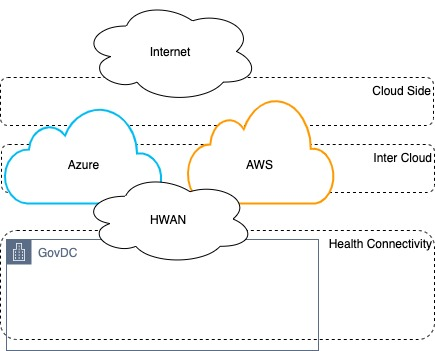

## Intercloud 
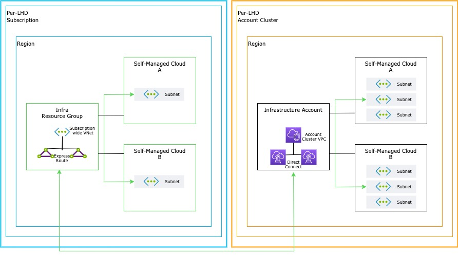
- SMC A can communicate to SMC B within the same subscription (Azure) or Account Cluster (AWS). SMC owners need to explicitly allow this communication by enabling the relevant cloud firewall rules.
- SMC A or B in Azure can communicate to SMC A or B in AWS by traversing the NSW Health HWAN network. SMC owners would need to explicitly allow this communication by enabling the relevant cloud firewall rules and also engage with the NSW Health SNS team to enable the relevant Edge vFW rules.
- For SMC communication between Health Entities, such as a SMC in LHD1 communicating with an SMC in LHD2 - additional firewall rule changes are required as each entity SMC tenancy terminates on its own HWAN Edge vRF to maintain traffic separation between entities.

## WAN 
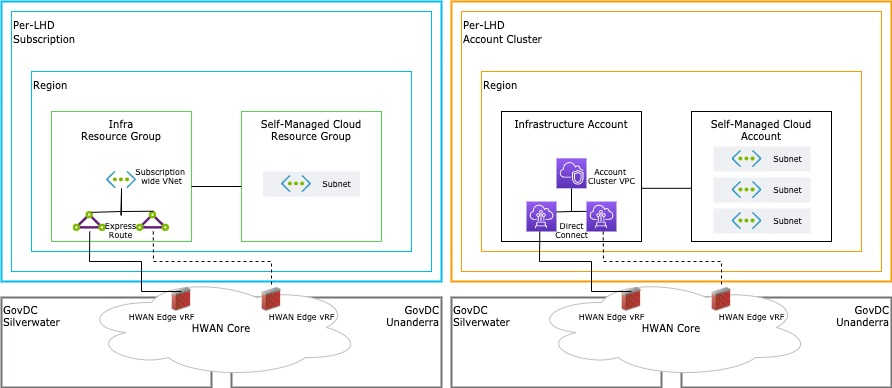

- ExpressRoute is an Azure service that lets you create private connections between Microsoft datacenters and infrastructure that’s on your premises or in a collocation facility.
- AWS Direct Connect is a cloud service solution that establishes private connectivity between AWS and your datacenter.
- Each geography contains one or more regions where resources can be provisioned. Self-Managed Cloud is restricted to Australia only regions.
- Subnets are a logically isolated allocation of health address space
- Infra Resource Group provides resources that provide connectivity for Self-Managed Cloud. This resource is managed by the Cloud Service Platform team.
- Infrastructure Account provides resources that provide connectivity for Self-Managed Cloud. This resource is managed by the Cloud Service Platform team.
- HWAN Edge vRF is a Virtual firewall instance that is managed by a health entity or the eHealth network team
- SMC Tenancies are split per HWAN Edge vRF to maintain traffic separation between health entities.
- Entities are provided on-premise connectivity through the HWAN Cloud Connect Service, which provides 3 seperate site-diverse links across 2 seperate carriers.

## Traffic Failover

- HWAN Cloud Connect Provides redundancy across GovDC Datacentres at Silverwater and Unanderra. During planned and unplanned failover events, traffic flow may change which will impact SMC Connectivity back to the on-premise network, and to Self-Managed Clouds in other providers that terminate on the same HWAN Edge vRF.
- By default, traffic for all SMC Tenancies destined for the on-premise network traverses the edge infrastructure at GovDC Silverwater.
- When there is planned or unplanned maintenance in Silverwater, traffic fails over to the secondary link at GovDC Unanderra.
- When there is a carrier-level failure of the primary and secondary links, traffic will fail over to the tertiary link located in GovDC Silverwater provided by a seperate carrier.
- Any traffic failover that causes SMC traffic to move between GovDCs will cause a brief loss of connectivity while sessions re-establish on the edge firewall at the new active site.
- All Cloud Providers for an SMC tenancy have their active site aligned with one another to ensure connectivity between the cloud providers is maintained. When a single cloud provider fails over to another site, the corresponding cloud providers for that entity are also failed over.
- Cloud Platform Team will provide customer notification to SMC Owners and Technical Delegates where traffic flow for an SMC tenancy is impacted, and will take proactive steps to mitigate any issues including failover outside of the carriers defined maintenance window to ensure SMCs in each provider are able to maintain connectivity anchored in a specific GovDC Site.

## Azure NW
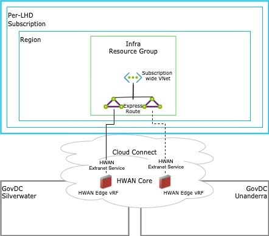
- Peer-to-peer connectivity between Self-Managed Clouds in the same Subscription is disabled by default but is supported. Peer-to-peer connectivity between Self-Managed Clouds in different Subscriptions is not supported and the traffic will flow back through HWAN from one SMC to another.

- When Health connectivity is requested a Self-Managed Cloud will be provisioned with an Azure subnet, partitioned from a shared VNet, whose IP address range is allocated from the Health Entity-assigned address space and is routable across HWAN. Each Health Entity has its own shared VNet.

## Aws Network
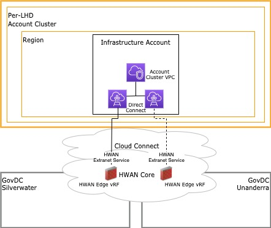
- Connectivity to the Health networks will provision the Self-Managed Cloud with a Shared Subnet partitioned from it’s Health Entity’s shared VPC, whose IP address range is allocated from Health Entity-assigned address space and is routable across HWAN.

## Azure Service EndPoints
The following Service Endpoint are enabled for the Self-Managed Cloud VNet. Once an endpoint has been enabled, all SMCs within a subscription can access it.

- Microsoft.AzureActiveDirectory
- Microsoft.AzureCosmosDB
- Microsoft.EventHub
- Microsoft.ServiceBus
- Microsoft.Sql
- Microsoft.Storage

## AWS Private Link

Private Link Endpoints

- VPC endpoints enable private connections between the account cluster VPC and supported AWS services using the NSW Health address space. Each account cluster VPC contains unique entries that can be consumed within Self-Managed Clouds.

## Azure Ip Allocation
Per-LHD Subscription - The subscription for the entity that contains all the SMC and also the Infra Resource Group
Australia East - The whitelisted region “Australia East” [Sydney] that contains the SMC Resource Groups
Australia Southeast - The whitelisted region “Australia Southeast” [Melbourne] that contains the SMC Resource Groups
Self-Managed Cloud Resource Group Left - Resource group name with the requested SMC name
Subnet Left - Single Subnet located in “Australia East” [Sydney] with 11 usable IP addresses
Self-Managed Cloud Resource Group Right - Resource group name with the requested SMC name
Subnet Right - Single Subnet located in “Australia Southeast” [Melbourne] with 11 usable IP addresses

## AWS Ip Allocation
Per-LHD Subscription - The subscription for the entity that contains all the SMC and also the Infra Resource Group
Australia East - The whitelisted region “Australia East” [Sydney] that contains the SMC Resource Groups
Australia Southeast - The whitelisted region “Australia Southeast” [Melbourne] that contains the SMC Resource Groups
Self-Managed Cloud Resource Group Left - Resource group name with the requested SMC name
Subnet Left - Single Subnet located in “Australia East” [Sydney] with 11 usable IP addresses
Self-Managed Cloud Resource Group Right - Resource group name with the requested SMC name
Subnet Right - Single Subnet located in “Australia Southeast” [Melbourne] with 11 usable IP addresses

## DNS 

### Azure
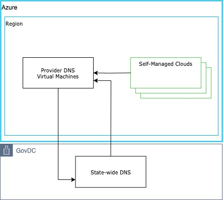

### Aws
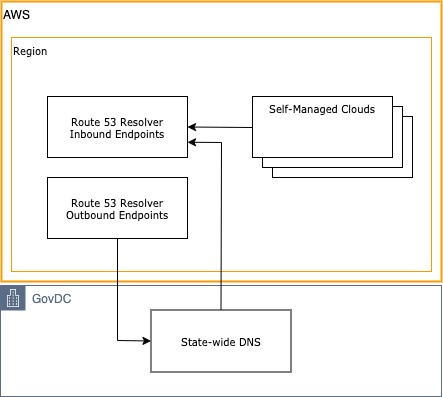

## Provider Shared Services 

### Foundational

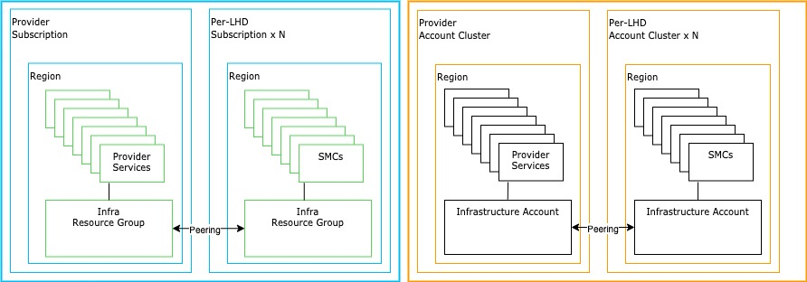
* SMC Users can join windows virtual machines to the nswhealth.net domain resulting in domain traffic residing cloudside.
* Provider Subscription - Azure Subscription within the assured platform that will host resources group (SMCs) that have the capability from a network aspect to be accessed from all entity SMCs if required
* Provider Account Cluster - Logical grouping of AWS accounts within the assured platform that will host AWS accounts (SMCs) that have the capability from a network aspect to be accessed from all entity SMCs if required
* Per-LHD Subscription x N - Each entity has a subscription dedicated to host SMCs when they subscribe to the eHealth Public Cloud Platform. This hosts the Infra Resource Group.
* Per-LHD Account Cluster x N - Each entity has a logical Account Cluster dedicated to host SMCs when they subscribe to the eHealth Public Cloud Platform. This includes the Infrastructure Account
* Infra Resource Group - The Infra Resource Group in an Entities Subscription is peered with the Provider Infra Resource Group within the Provider Subscription. This enables network traffic flow to occur if allowed, from the entities resources to resources in the Provider Subscription. This is foundational to how Provider services are consumed Cloudside.
* Infrastructure Account - The Infrastructure Account in an Entities Subscription is peered with the Provider Infrastructure Account within the Provider Account Cluster. This enables network traffic flow to occur if allowed, from the entities resources to resources in the Provider Subscription. This is foundational to how Provider services are consumed Cloudside

### JH

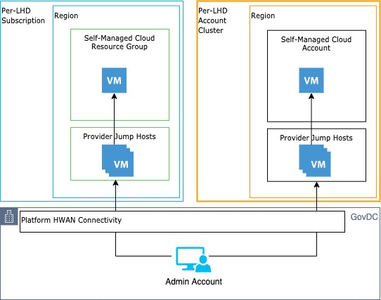

### PX

#### Linux add certs

* Controlled internet gateway services on a whitelisting basis (i.e. allowing websites known to be harmless through the proxy);
* Blocking unwanted web traffic originating from the Self-Managed Cloud, Blueprint and Private Cloud environments towards the internet;
* Recording application level (Layer 7) connection details via the SSL inspection feature, and forwarding web traffic events to Symantec HSOC for threat analysis and long-term retention.

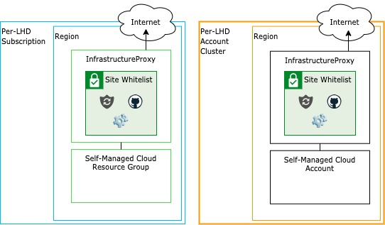
``` Ubuntu
mv NSWHEALTH-RootCA.crt /usr/local/share/ca-certificates/ &&  update-ca-certificates
/etc/apt/apt.conf.d/proxy.conf
Acquire::http::Proxy "http://<refer to 'Service endpoints'>:3128/";
Acquire::https::Proxy "http://<refer to 'Service endpoints'>:3128/";

```

``` RHCE
mv NSWHEALTH-RootCA.crt /etc/pki/ca-trust/source/anchors/
mv NSWHEALTH-RootCA.crt /usr/local/share/ca-certificates/
  /bin/update-ca-trust enable
/etc/yum.conf
[main]
  proxy=http://<refer to 'Service endpoints'>:3128

```

#### Windows add certs

* Run mmc.exe as Administrator
* Click on File –> Add/Remove Snap-in…
* Select Certificates and click on Add.
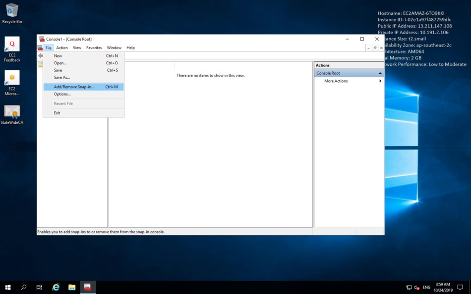

* Select Computer account and click Next.
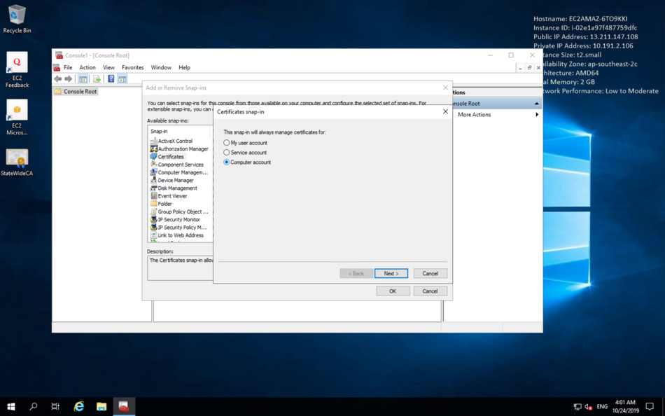

* Leave the setting on Local computer and click Finish.


* Click OK to apply the new settings.
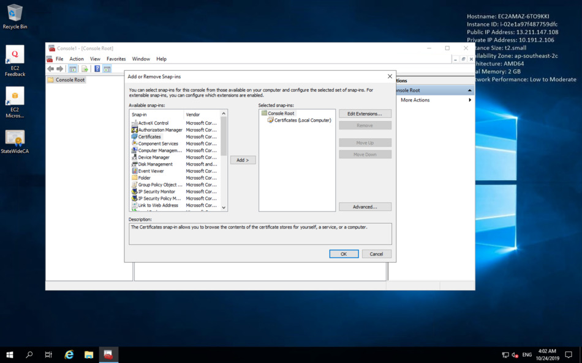

* Open Trusted Root Certificate Authorities.
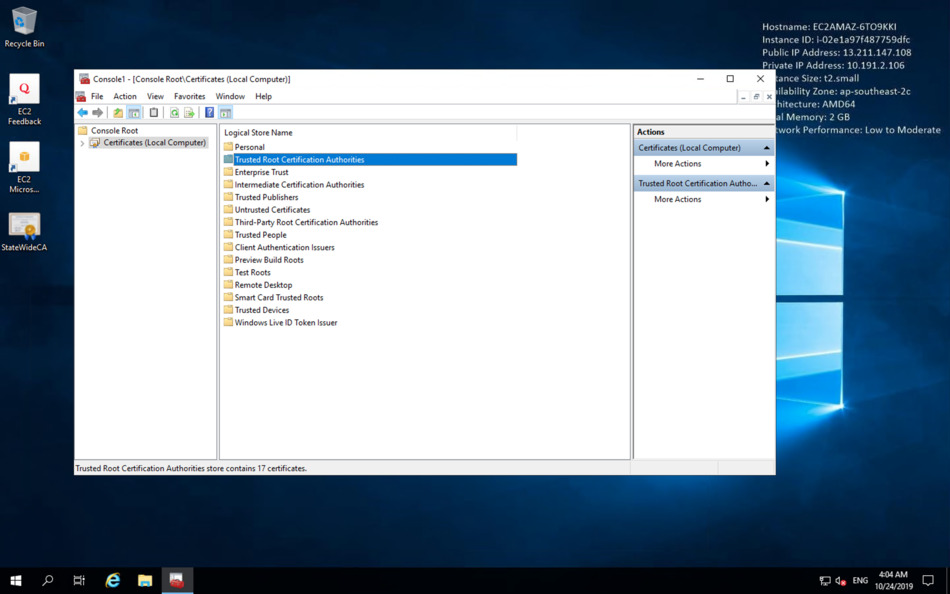

* Open Certificates.
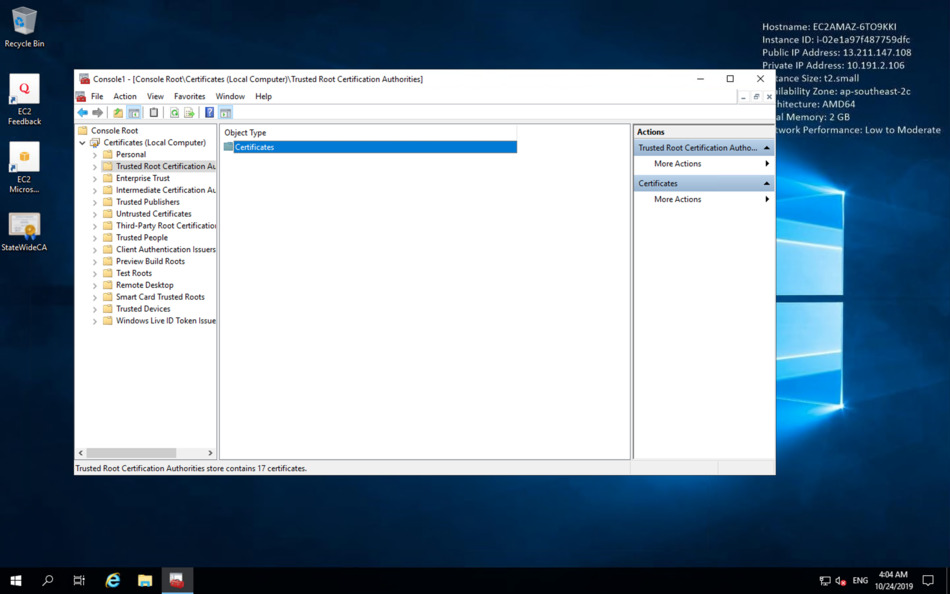
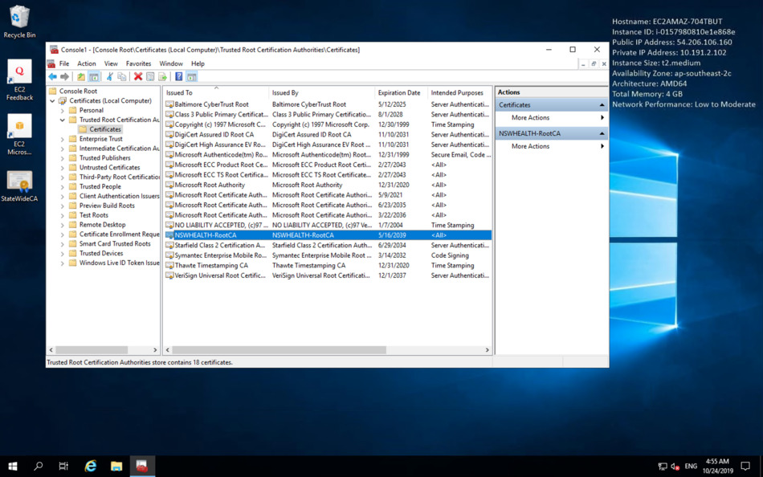

* Right-click on an empty area and select All tasks –> Import.
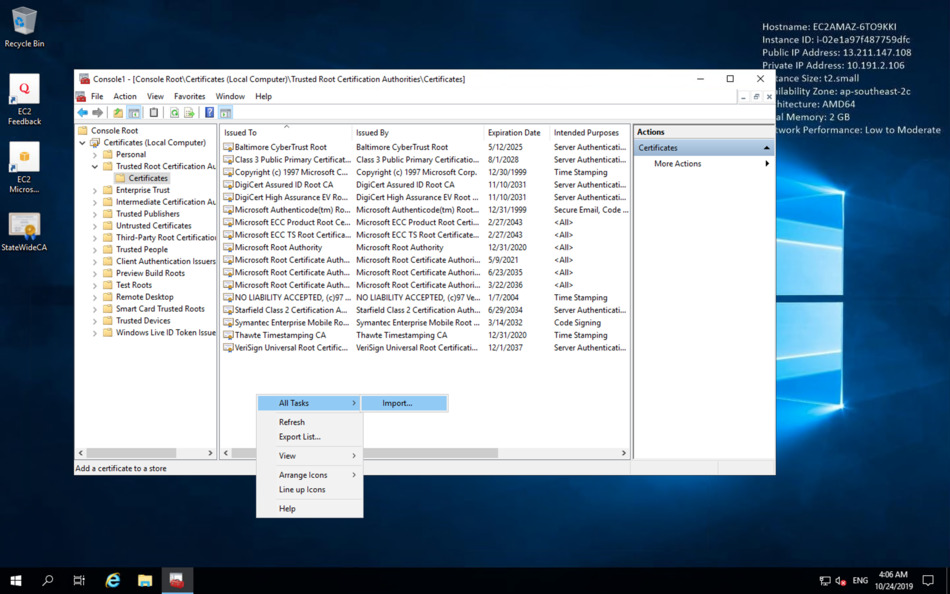

* Choose the state-wide root CA file
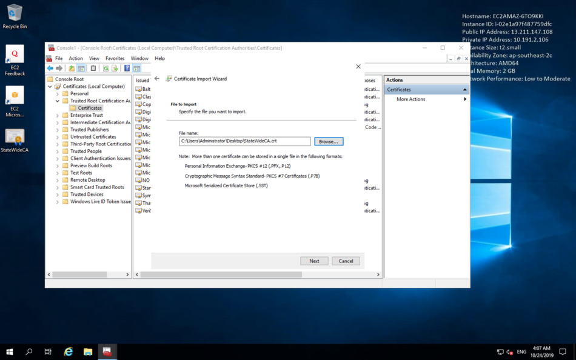

* Click on Next and leave the default settings
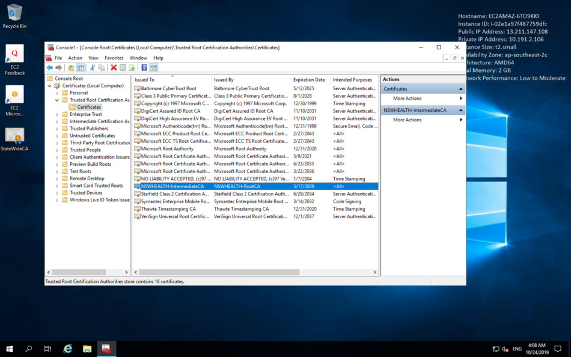

* Click Finish. If the import was successful, you should see a pop up message after a few seconds.
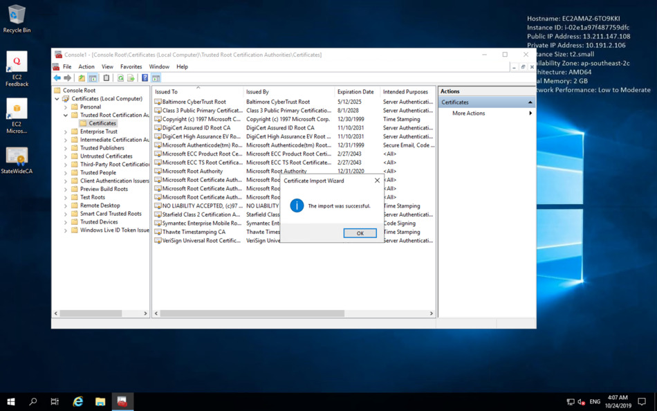

* The state-wide root CA certificate should be on the list.


#### Configure Local Proxy

- Option 1: User Profile Proxy
Where a service uses user-profile specific proxy configuration data, this method should be used.

Open Proxy Settings from the Start menu.

- Option 2: WinHTTP Proxy
This option is useful for system-level services using WinHTTP to communicate with the internet (eg. Certificate revocation via CryptoAPI, and Windows Update).

```
netsh winhttp set proxy infraproxy-<region>.<azure|aws>.health.nsw.gov.au:3128 "<local>,10.*,169.254.*,127.0.*,*.nswhealth.net"
```

- Proxy alternative: service tags
If you wish to avoid using the infrastructure proxy for obtaining Windows Updates, but still prefer to restrict egress traffic on your NSG or Azure Firewall, the new Windows Update service tag may help.

An Azure service tag represents a group of IP address prefixes. Microsoft manages the Windows Update address prefixes encompassed by the AzureUpdateDelivery service tag and automatically updates the service tag as addresses change, minimising the complexity of frequent updates to network security rules.

Please refer to the [Virtual network service tags](https://docs.microsoft.com/en-us/azure/virtual-network/service-tags-overview) KB article at Microsoft to learn how you can add the AzureUpdateDelivery service tag to your NSGs or Azure Firewalls.

