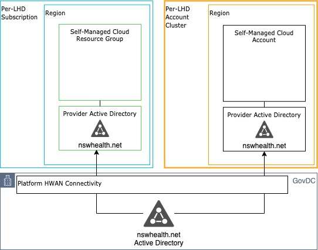
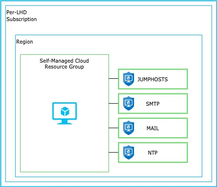
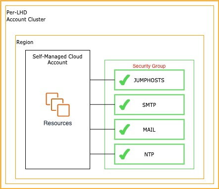

# Key Notes for MC Landing Zone 

## Provider Shared Services (Continued)

### AD

NSWHealth domain controllers are hosted within Azure & AWS to provide Active Directory domain services. Currently, the nswhealth.net domain is available only. Additional Domains and trusted forests are out of scope from the platform as nswhealth.net is the strategic direction as a consolidated state-wide directory.

It can be consumed by associating your resources with the provider services Security Groups (AWS), or attaching the DOMAINSERVICES Application Security Group (Azure) see below.

Summary of features:

* Standard Client->DC Connectivity as per current on-premise capability
* Authentication of Users within the nswhealth.net domain
* Management of Computers using Group Policy

Some additional Provider Services require Domain Services as a pre-requisite to operate. These include:
* Windows Server Certificate Enrollment via RPC (Certificates MMC Snap-in)

### Access to Provider Shared Services

#### Azure

Application security groups (ASG) enable you to configure network security as a natural extension of an application’s structure, allowing you to group virtual machines and define network security policies based on those groups.

These rules can be used to provide access to services. The Cloud Platform Team will add additional ASGs over time as more provider services become available.

##### Adding Custom Rules

Additional rules can and should be created to provide the resources within to communicate over known and approved communication paths. Rules are processed in priority order, the lower the number the higher the priority.

See the following link for more information -> https://docs.microsoft.com/en-us/azure/virtual-network/manage-network-security-group

Rules with a priority between 4000 and 4096 are reserved for Provider Services and they will be managed and updated by eHealth Cloud Platform team. Self-Managed Cloud users should create custom rules with a priority lower than 4000.

#### AWS

A security group acts as a virtual firewall for your instance to control inbound and outbound traffic. Each security group defines rules that control the inbound traffic to instances, and a separate set of rules that control the outbound traffic.

As part of the provisioning of your Self-Managed Cloud several Security Groups are created. Security Group rules have been created for the various provider services. These rules should be used to provide access to these services and will increase over time as more provider services become available.

##### Adding Custom Rules
Additional rules can and should be created to provide the resources within to communicate over known and approved communication paths. The Provider created security group cannot be modified by the SMC Owner or Technical delegates. Additional security groups with application specific rules can be configured and assigned to your instances. As noted above, the Provider security groups can be copied and used to establish a custom least privileged rule sets for the target resources.

See the following link for more information -> https://docs.aws.amazon.com/vpc/latest/userguide/VPC_SecurityGroups.html

#### Prefix Lists
Managed Prefix Lists are now available within AWS Self-Managed Cloud. They provide a more granular approach to consuming provider services, but providing a dynamic list of IPs that represents a service, that can be added into your own security groups. 

https://docs.aws.amazon.com/vpc/latest/userguide/managed-prefix-lists.html#vpc-security-groups
https://docs.aws.amazon.com/vpc/latest/userguide/amazon-vpc-limits.html

