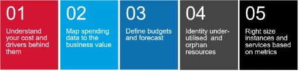
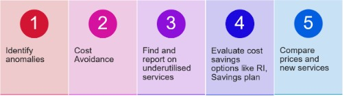
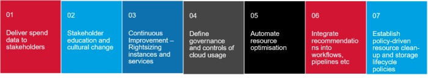

# Key Notes for MC Landing Zone 

# Security and Compliance Checks

* Detection of publicly exposed AWS S3 buckets

* Detection of publicly exposed Azure Storage Account

* Identity Management
Default RBAC 
Power: Allows the user manage everything, but not assign additional permissions to anyone within the platform.
Owner: Allows the user manage everything, including access to resources.
Reader: Allows the user to view everything, but not make any changes.

* Encryption at rest

* Encryption in transit

* Endpoint Protection (AV, Host IDP)

* Secure OS Images (CIS)
Compliant with the CIS Level 1 standard
CIS-recommended security hardening settings are applied
Licensing Inventory agent is installed by default
Symantec Endpoint Protection (SEP) antivirus agent is installed by default
Root CA is installed by default
Azure Log Analytics event log forwarding agent is installed by default
AWS Systems Manager (SSM) agent is installed by default
AWS Inspector (vulnerability scanner) agent is installed by default

* Event Log Monitoring
AWS CloudTrail logs
Azure Activity Logs
Jump Host logs
Infrastructure Proxy traffic logs

* Remote Management

* Secure Internet Gateway

* Virtual Machine Patching

Azure Automation
Azure Guest VM Patching
AWS Systems Manager Patch Manager
yum-cron (RHEL)
cron-apt (Ubuntu/Debian)

* Database Security
AWS RDS: Encrypting Amazon RDS resources
AWS RDS: Using SSL/TLS to encrypt a connection to a DB instance
Azure SQL: Encryption at Rest
Azure SQL: Enable encrypted connections to the Database Engine

https://docs.microsoft.com/en-us/azure/azure-sql/database/threat-detection-overview
https://docs.microsoft.com/en-us/azure/azure-sql/database/secure-database-tutorial
https://docs.aws.amazon.com/AmazonRDS/latest/UserGuide/CHAP_BestPractices.Security.html

* SOC alerts

Azure Security Centre and AWS Security Hub

# FinOps

Inform Phase - allocate, benchmark, and forecast cloud service needs.
The Inform phase gives you the visibility required for success by showing teams what they’re spending and why.

Contrast the service needs of the company with discounts for time and reserved usage in order to get the cheapest rates.
Empower your teams to identify and measure efficiency optimizations, like rightsizing, storage access frequency, or improving reserved instance coverage.

Continuously evaluate the performance of cloud services against business objectives for speed, quality and cost.
Defines processes which enable the goals of Technology, Finance and Business to be achieved.

## Links

- Azure DNS Server
https://learn.microsoft.com/en-us/azure/virtual-network/virtual-networks-name-resolution-for-vms-and-role-instances

- Azure Subnet Delegation
https://learn.microsoft.com/en-us/azure/virtual-network/subnet-delegation-overview

