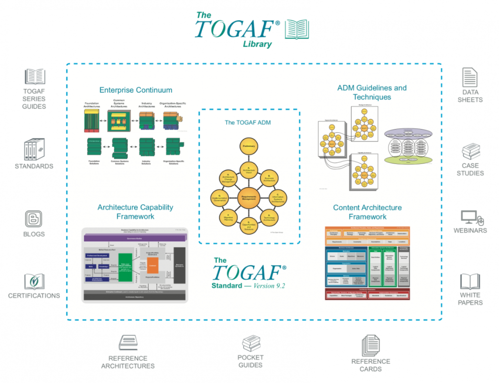

# Togaf

The key pillars of the TOGAF Framework

Architecture Development Method (ADM)
ADM Guidelines and Techniques
Enterprise Continuum
Content Architecture Framework
Architecture Capability Framework

# References

1. [EA Blog](https://www.digitalcolmer.com/blog/whats-new-in-togaf-92)
1. [OpenGroup Blog](http://www.opengroup.org/cloud/cloud_ecosystem_rm/p5.htm)
